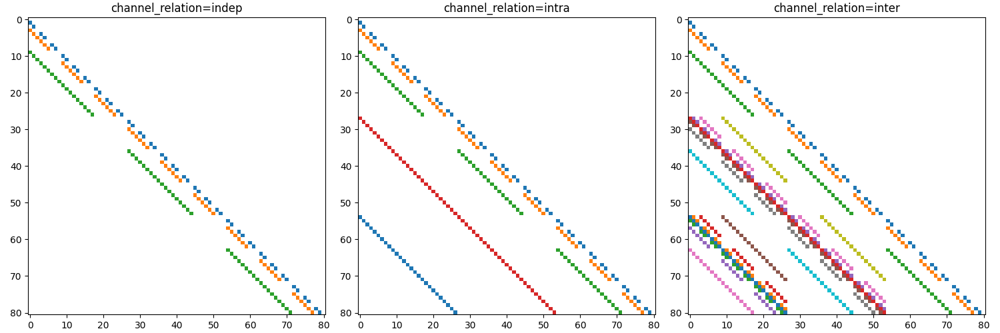
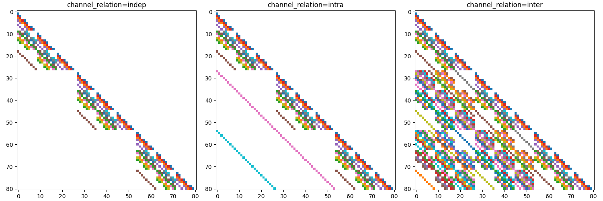

# torchsparsegradutils: Sparsity-preserving gradient utilities for PyTorch, backed by native CUDA kernels

[](https://pypi.org/project/torchsparsegradutils/) [](https://pypi.org/project/torchsparsegradutils/)  [](https://github.com/cai4cai/torchsparsegradutils/actions/workflows/python-package.yml) [](https://readthedocs.org/projects/torchsparsegradutils) [](LICENSE) [](https://joss.theoj.org/papers/6da0e92488d06f70c0a03d0a7cbfba7d)

Sparse autograd utilities for PyTorch, implemented on our own CUDA kernels (the
`tsgu::` op set). Every operation computes gradients with respect to a sparse
input **at that input's sparsity pattern, in that input's layout** — never by
materialising a dense gradient. The package fills long-standing gaps in
PyTorch's sparse ecosystem (sparse gradients for matmul and solves, a native
sparse `logsumexp`) and is batched-first throughout.

## Architecture

Two packages, one repo:

| Package | Contents | Ships as |
|---------|----------|----------|
| **`torchsparsegradutils`** | Pure Python: public API wrappers, `torch.library` op definitions, dispatch, host-side composites (Krylov loops, distributions, encoder, utils) | pure-Python wheel — no compiler, ever |
| **`torchsparsegradutils_cuda`** | The CUDA kernels (`cuda/csrc/`), registered into the same `tsgu::` ops at import | prebuilt binaries via [HF kernel-builder](https://huggingface.co/docs/kernels) (see Installation) |

Key design points:

- **Native CUDA kernels.** All core ops route to custom kernels in the
  `tsgu::` namespace (`spmm`, `sddmm`, `spsm`, `seglse`, `seglse_bidir`,
  `coo2csr`, `grouped_gemm`), benchmarked head-to-head against their
  cuSPARSE/cuBLAS counterparts. Two kernel families have **no vendor primitive
  at all**: the SDDMM-shaped sparse-gradient kernel (batched/COO) shared by
  every solve/matmul backward, and the segmented logsumexp family.
- **Memory-sparse gradients.** The gradient of a loss w.r.t. a sparse matrix
  `A` is a sparse tensor with `A`'s pattern and layout. For a `524k × 524k`
  system the dense-gradient counterfactual is measured in terabytes; ours is
  O(nse).
- **Batched-first.** One leading batch axis, ragged nse per batch item
  supported (COO batching's flexibility with CSR's kernel-friendliness) via an
  internal `BatchedCSR` descriptor; an unbatched matrix is simply a batch of
  one. The old block-diagonal batching workaround is gone.
- **`torch.library` custom ops.** Each kernel-backed op is registered with
  `torch.library.custom_op` + fake kernels + `register_autograd`, so the ops
  are `torch.compile`-compatible and every op is `torch.library.opcheck`-tested.
- **CUDA-required at runtime.** There is no CPU implementation in the shipped
  package (by design — see Installation).

## Public API

Core ops (all with sparsity-preserving autograd; COO and CSR accepted,
unbatched or batched):

| Function | What it does | Kernels (fwd / bwd) |
|----------|--------------|---------------------|
| `sparse_mm(A, B)` | sparse × dense matmul | `tsgu::spmm` / `tsgu::sddmm` + `tsgu::spmm` |
| `sparse_triangular_solve(A, B, upper, unitriangular, transpose)` | triangular solve | `tsgu::spsm` / `tsgu::spsm` + `tsgu::sddmm` |
| `sparse_generic_solve(A, B, solve, transpose_solve)` | iterative solve with pluggable solver callables | host loop over `tsgu::spmm` / `tsgu::sddmm` |
| `sparse_generic_lstsq(A, B, lstsq, transpose_lstsq)` | iterative least squares | host loop over `tsgu::spmm` / `tsgu::sddmm` |
| `sparse_logsumexp(input, dim, keepdim, include_zeros)` | sparse log-sum-exp mirroring `torch.logsumexp` | `tsgu::seglse` / `tsgu::seglse_bwd` |
| `sparse_bidir_logsumexp(input, ...)` | row + column log-sum-exp in one fused traversal | `tsgu::seglse_bidir` / `tsgu::seglse_bidir_bwd` |
| `segment_mm(a, b, seglen_a)` | segmented dense matmul (DGL-exact semantics) | `tsgu::grouped_gemm` |
| `gather_mm(a, b, idx_b)` | gathered dense matmul (DGL-exact semantics) | `tsgu::grouped_gemm` (gather fused) |

Plus:

- **Iterative solvers** (`torchsparsegradutils.utils`): `linear_cg`,
  `bicgstab`, `lsmr`, `minres` (with `LinearCGSettings`, `BICGSTABSettings`,
  `MINRESSettings`) — host-side loops whose matvecs run on `tsgu::spmm`.
- **Convert utils** (`torchsparsegradutils.utils`): `convert_coo_to_csr`,
  `convert_coo_to_csr_indices_values` (backed by `tsgu::coo2csr`),
  `stack_csr`, `sparse_eye`, plus random sparse generators and statistical
  test helpers.
- **Distributions** (`torchsparsegradutils.distributions`):
  `SparseMultivariateNormal` (LL^T / LDL^T, covariance or precision) and
  `SparseMultivariateNormalNative`, with reparameterised sampling.
- **Encoder** (`torchsparsegradutils.encoders`): `PairwiseEncoder` for sparse
  neighbourhood encoding of nD spatial volumes, and
  `calc_pairwise_coo_indices_nd`.

### Removed in this release (breaking, no deprecation cycle)

The CUDA rewrite is a breaking release. The following are **removed outright**,
with no migration path:

- The **CuPy bridge** (`torchsparsegradutils.cupy`: `sparse_solve_c4t`,
  `t2c_*`/`c2t_*`) and the **JAX bridge** (`torchsparsegradutils.jax`:
  `sparse_solve_j4t`, `j2t*`/`t2j*`). They existed to borrow CUDA solvers the
  package now has natively.
- The **block-diagonal helpers** `sparse_block_diag` and
  `sparse_block_diag_split`. They faked batched sparse ops; the kernels are
  natively batched.
- The **`autograd.Function` classes** `SparseMatMul`, `SparseTriangularSolve`,
  `SparseGenericSolve`, `SparseGenericLstsq`. The public functions remain;
  the classes are replaced by `torch.library` op registration.
- The deprecated `PairwiseVoxelEncoder` alias and
  `calc_pairwise_coo_indices`.

All *surviving* signatures are frozen at their v0.2.3 forms — names,
parameters, defaults, and return types are unchanged.

## Installation

The front package is pure Python:

```bash
pip install torchsparsegradutils
```

**A CUDA backend is required at runtime.** The core ops are CUDA-only: there
is no CPU fallback in the shipped package, and calling an op without the
backend (or on CPU tensors) raises a clear error — that error is intentional,
not a bug. The backend package `torchsparsegradutils_cuda` is built with
[Hugging Face kernel-builder](https://huggingface.co/docs/kernels) from the
`cuda/` directory of this repo and distributed through the Hugging Face Hub
(kernel-builder's Nix build produces the binaries; `build-and-upload`
publishes them). Prebuilt wheels for the backend are a post-migration item and
do not exist yet — until then, build from `cuda/` with kernel-builder or pull
the published kernel from the Hub.

The two packages perform a version handshake at import
(`__backend_api_version__`); a mismatch refuses to wire them together rather
than failing later in a kernel.

For **import-only workflows** (docs builds, CPU-only CI collecting tests,
introspection) set:

```bash
export TSGU_DISABLE_CUDA_BACKEND=1
```

which skips the backend probe; `import torchsparsegradutils` then works
without a GPU, but calling any kernel-backed op raises.

### Requirements

- **Python** ≥ 3.10
- **PyTorch** ≥ 2.5
- **NVIDIA GPU + CUDA** for anything beyond importing the package

## Benchmarks

Full protocol, tables, memory companion data, and charts live in
[`spec/benchmarks.md`](spec/benchmarks.md) — that file is the record; the
numbers below are its headline geo-means. Measured 2026-07-15 → 2026-07-17 on
the migration dev box: **NVIDIA RTX A1000 Laptop GPU, torch 2.13.0+cu130,
CUDA 13.0, clocks not locked** (recorded per-run instead) — a modest laptop
GPU, so treat absolute times accordingly; speedups are like-for-like on the
same machine. Corpus: synthetic tier (batched/ragged sweeps), per the
migration-period rule.

| Claim | Result |
|-------|--------|
| vs. like-for-like vendor calls (cuSPARSE SDDMM, SpSM cold/warm) | geo-mean **1.52×** faster |
| batched / fused / legacy-composite paths (batched SpMM/SDDMM/SpSM, fused bidir logsumexp, grouped GEMM vs per-segment cuBLAS loop, coo2csr, vs `pytorch_scatter` and the old pure-PyTorch paths) | geo-mean **8.11×** faster |
| e2e `SparseMultivariateNormal.rsample`, encoder-CSR vs encoder-COO | **4.1×** faster, **0.56×** the backward peak memory |
| e2e CG solve vs dense `torch.linalg.solve` (n = 4096) | **~16×** faster |
| memory: encoder-CSR rsample backward peak vs dense-gradient counterfactual | 402 MB vs ~1.1 TB (**~2700×** saved) at 2×64³ |

One acceptance bar is honestly still open: `grouped_gemm` on segment shapes
reaches **0.5–0.8×** of cuBLAS `cublasGemmGroupedBatched` (the fused
gather path and both backwards beat their baselines; the follow-up —
vectorised 128-bit loads + double buffering — is tracked). Every other bar in
the spec is met, with all rows `backend=custom` (no vendor-scaffold rows in
any claim).

## Quick Start

All ops run on CUDA tensors.

### Sparse matrix multiplication

```python
import torch
from torchsparsegradutils import sparse_mm

# Sparse matrix in COO layout, on GPU
indices = torch.tensor([[0, 1, 1], [2, 0, 2]], dtype=torch.int64)
values = torch.tensor([3., 4., 5.])
A = torch.sparse_coo_tensor(indices, values, (2, 3)).cuda()
A.requires_grad_(True)

B = torch.randn(3, 4, requires_grad=True, device="cuda")

C = sparse_mm(A, B)
C.sum().backward()

print(A.grad.is_sparse)   # True — gradient at A's pattern, in A's layout
print(A.grad._nnz())      # 3
```

Batched (with ragged nse per item for COO):

```python
A1 = torch.sparse_coo_tensor([[0, 1], [0, 1]], [1., 2.], (2, 2)).cuda()
A2 = torch.sparse_coo_tensor([[0, 1], [1, 0]], [3., 4.], (2, 2)).cuda()
A_batch = torch.stack([A1, A2])          # (2, 2, 2)
B_batch = torch.randn(2, 2, 3, device="cuda")

C = sparse_mm(A_batch, B_batch)          # (2, 2, 3)
```

### Sparse log-sum-exp

```python
import torch
from torchsparsegradutils import sparse_logsumexp, sparse_bidir_logsumexp
from torchsparsegradutils.utils import rand_sparse

A = rand_sparse((512, 256), nnz=4096, layout=torch.sparse_csr, device="cuda")

lse_over_rows = sparse_logsumexp(A, dim=0)      # one value per column
lse_over_cols = sparse_logsumexp(A, dim=1)      # one value per row

# Both reductions in a single fused traversal
lse0, lse1 = sparse_bidir_logsumexp(A)
```

### Sparse linear systems

```python
import torch
from torchsparsegradutils import sparse_triangular_solve, sparse_generic_solve
from torchsparsegradutils.utils import linear_cg
from torchsparsegradutils.utils.random_sparse import rand_sparse_tri, make_spd_sparse

# Triangular solve
L = rand_sparse_tri((1000, 1000), nnz=5000, upper=False,
                    layout=torch.sparse_csr, device="cuda")
b = torch.randn(1000, 2, device="cuda")
x = sparse_triangular_solve(L, b, upper=False)

# Generic solve with a pluggable iterative solver (user callables also work)
A, _ = make_spd_sparse(1000, torch.sparse_csr, torch.float32, torch.int64, "cuda")
y = sparse_generic_solve(A, b[:, 0], solve=linear_cg)
```

### Sparse multivariate normal

```python
import torch
from torchsparsegradutils.distributions import SparseMultivariateNormal
from torchsparsegradutils.utils.random_sparse import rand_sparse_tri

dim = 1000
loc = torch.zeros(dim, device="cuda")
diagonal = torch.ones(dim, device="cuda") * 0.5    # LDL^T parameterisation
scale_tril = rand_sparse_tri((dim, dim), nnz=5000, upper=False,
                             layout=torch.sparse_csr, strict=True, device="cuda")
scale_tril.requires_grad_(True)

dist = SparseMultivariateNormal(loc=loc, diagonal=diagonal, scale_tril=scale_tril)
samples = dist.rsample((100,))
samples.sum().backward()
print(scale_tril.grad._nnz())  # 5000 — sparse gradient at the input pattern
```

### Pairwise spatial encoding

```python
import torch
from torchsparsegradutils.encoders import PairwiseEncoder

volume_shape = (4, 64, 64, 64)  # channels, height, depth, width
encoder = PairwiseEncoder(radius=2.0, volume_shape=volume_shape,
                          layout=torch.sparse_csr, device="cuda")

values = torch.randn(len(encoder.offsets), *volume_shape, device="cuda")
sparse_matrix = encoder(values)  # sparse CSR encoding of the neighbourhood
```

The encoder outputs COO or CSR; with the rewrite the CSR path is now *more*
memory-efficient in the backward pass than COO (≈ 0.56× the peak), reversing
the CSR blow-up documented in older releases.

**3D spatial grid (3×3×3×3) with different channel relations:**

<div align="center">

**Radius = 1.0**


**Radius = 2.0**


</div>

### Indexed matrix operations (GNN workloads)

```python
import torch
from torchsparsegradutils import segment_mm, gather_mm

a = torch.randn(15, 10, requires_grad=True, device="cuda")   # node features
b = torch.randn(3, 10, 5, requires_grad=True, device="cuda") # per-type weights
seglen_a = torch.tensor([5, 6, 4], device="cuda")

# a[0:5] @ b[0], a[5:11] @ b[1], a[11:15] @ b[2] — DGL segment_mm semantics
out = segment_mm(a, b, seglen_a)

idx_b = torch.tensor([0, 0, 1, 1, 2], device="cuda")
out = gather_mm(torch.randn(5, 10, device="cuda"), b, idx_b)
```

## Testing and Benchmarks

```bash
# CPU-safe subset (schemas, fake kernels, host utils; CUDA tests skip cleanly)
uv run pytest tests/

# The full six-stage GPU gate (opcheck, parity vs the frozen oracle,
# gradcheck, hypothesis, statistical suites) — needs a GPU + backend
uv run tox -e gpu

# CPU test matrix
uv run tox -e py312-torch-stable
```

The old pure-PyTorch implementations survive **only** as a frozen differential
oracle in `tests/oracle/` — they are never packaged.

Benchmarks live in `benchmarks/` (op-level harness writing provenance-stamped
JSON to `benchmarks/results/`) and `cuda/bench/` (per-kernel NVBench
microbenchmarks). The protocol — locked-clock policy, L2 flush between
iterations, median-of-windowed CUDA-event timing, mandatory memory
measurement, `custom` vs `vendor-scaffold` provenance — is specified in
[`spec/benchmarks.md`](spec/benchmarks.md).

## Contributing

Contributions are welcome — see [GitHub Issues](https://github.com/cai4cai/torchsparsegradutils/issues)
and the docs' contributing guide. In short:

```bash
git clone https://github.com/cai4cai/torchsparsegradutils
cd torchsparsegradutils
uv sync --group dev
pre-commit install
```

Tooling: **uv** (packaging + lockfile), **ruff** (lint + format),
**clang-format/clang-tidy** (CUDA/C++), **pyrefly** (types), **tox** via
tox-uv (test matrix). Naming and shape conventions are binding for new code
and docs — see `docs/source/naming.rst`. The design record for the CUDA
rewrite lives in [`spec/`](spec/index.md).

## License

This project is licensed under the Apache License 2.0 — see the
[LICENSE](LICENSE) file for details.

## Acknowledgments

- **PyTorch Team**: for the foundational sparse tensor implementations
- **Open source libraries** whose algorithms our host-side solvers port and adapt:
  - [pykrylov](https://github.com/PythonOptimizers/pykrylov) (BICGSTAB)
  - [cornellius-gp/linear_operator](https://github.com/cornellius-gp/linear_operator) (CG, MINRES)
  - [pytorch-minimize](https://github.com/rfeinman/pytorch-minimize) (LSMR)

## Citation

If you use this package in your research, please cite:

```bibtex
@software{torchsparsegradutils,
  title={torchsparsegradutils: Sparsity-preserving gradient utility tools for PyTorch},
  author={Barfoot, Theodore and Glocker, Ben and Vercauteren, Tom},
  url={https://github.com/cai4cai/torchsparsegradutils},
  year={2024}
}
```

## Known Issues

### PyTorch sparse COO index dtype coercion

PyTorch converts `int32` indices to `int64` when constructing sparse COO
tensors, but preserves `int32` for CSR. The kernels support both index dtypes
and preserve the input's dtype through outputs and gradients — except where
PyTorch itself has already coerced a COO input to `int64` upstream. Prefer CSR
when `int32` indices matter for memory.

### SparseMultivariateNormal LL^T precision parameterisation

The LL^T parameterisation combined with a precision matrix can produce large
gradients under poor conditioning. Use the LDL^T parameterisation (separate
`diagonal` plus unit-triangular factor) for precision matrices — it is the
numerically stable formulation and the recommended default.
