Benchmarks
==========

This section presents performance benchmarks and comparisons for torchsparsegradutils operations.

Benchmark Overview
------------------

Our benchmarking suite evaluates the performance of sparse linear algebra operations across different:

- **Matrix sizes and sparsity patterns**
- **Data types (float32/float64, int32/int64 indices)**
- **Sparse layouts (COO/CSR)**
- **Backend implementations (PyTorch, CuPy/SciPy, JAX)**
- **Forward and backward pass performance**
- **Memory efficiency during gradient computation**

All benchmarks are performed using an NVidia RTX 4090 with CUDA 12.8 and PyTorch 2.8.0

For benchmarking we use a real-world sparse matrices from the SuiteSparse Matrix Collection.
Specifically the `Rothberg/cfd2 <https://sparse.tamu.edu/Rothberg/cfd2>`_ matrix with shape 123,440 x 123,440 and 3,085,406 non-zeros elements.

Sparse Matrix Multiplication
----------------------------

This benchmark evaluates sparse × dense matrix multiplication with gradient computation on a large real-world matrix from the SuiteSparse collection.

**Algorithms Compared:**

.. list-table::
   :header-rows: 1
   :widths: 28 47 15

   * - **Code Call**
     - **Description**
     - **Plot Alias**
   * - ``torch.sparse.mm(A, B)``
     - PyTorch built‑in sparse (COO/CSR) @ dense
     - torch spmm
   * - ``tsgu.sparse_mm(A, B)``
     - torchsparsegradutils sparse @ dense multiplication with full sparse gradient support (COO + CSR)
     - tsgu spmm
   * - ``(A.to_dense() @ B)``
     - Dense PyTorch baseline formed by densifying the sparse matrix prior to multiplication
     - dense mm

**Methodology:**

We multiply the SuiteSparse matrix ``Rothberg/cfd2`` (shape 123,440 × 123,440, nnz 3,085,406; sparsity ≈ 99.98%) with a dense matrix ``B`` of shape (123,440 × 128) for each combination of:

- Index dtype: ``int32`` / ``int64``
- Value dtype: ``float32`` / ``float64``
- Sparse layout: ``torch.sparse_coo`` / ``torch.sparse_csr``

Each algorithm run reports forward and backward wall‑clock time (µs) and peak CUDA memory (MB) using ``torch.cuda.max_memory_allocated``. We perform 100 measurement repetitions (``REPEATS=100``) after 10 warmup passes (``WARMUP_RUNS=10``). Per repetition a fresh cloned tensor (with gradients) is used to avoid accumulation side‑effects. Interquartile range (IQR) filtering removes high / low outliers (±1.5×IQR) before computing mean and standard deviation (error bars). Dense variants and COO backward for ``torch.sparse.mm`` frequently raise CUDA OOM; attempted allocation sizes (≈58 GB for float32, ≈116 GB for float64) are captured and visualized as failed points.

**Key Testing Features:**

- Real CFD matrix stresses memory hierarchy rather than synthetic uniform sparsity.
- Explicit gradient pass included (``out.sum().backward()``) to expose backward memory amplification.
- OOM handling recorded to highlight infeasible configurations (dense & some COO backward paths).
- Index dtype sensitivity measured (``int32`` marginally lowers memory versus ``int64`` for COO despite internal ``int64`` index returns).
- Unified timing & memory harness shared across all benchmark suites for comparability.
- Layout conversion path (CSR→COO internally for some gradients) explains backward memory differences.

**Results:**

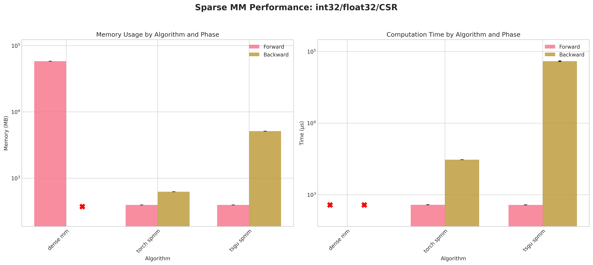

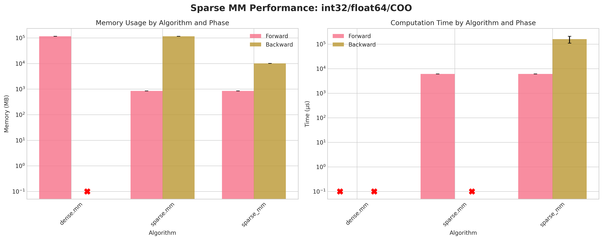

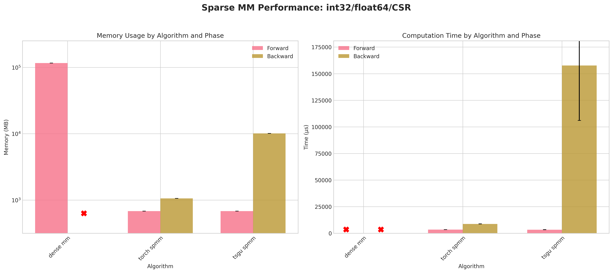

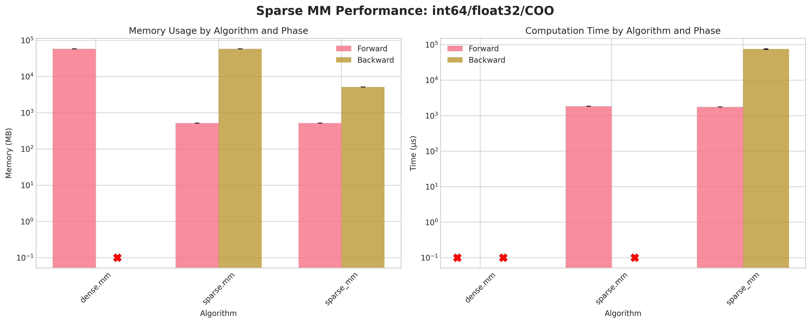

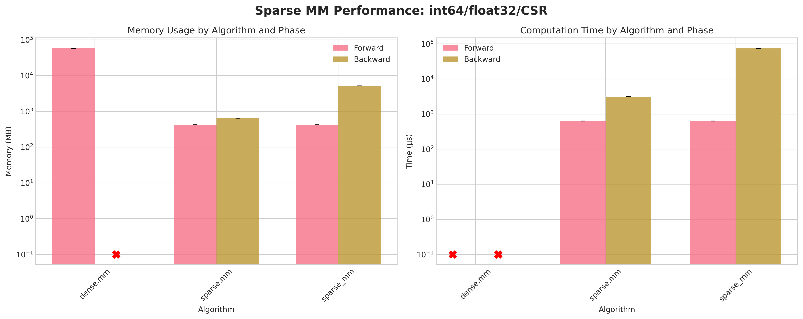

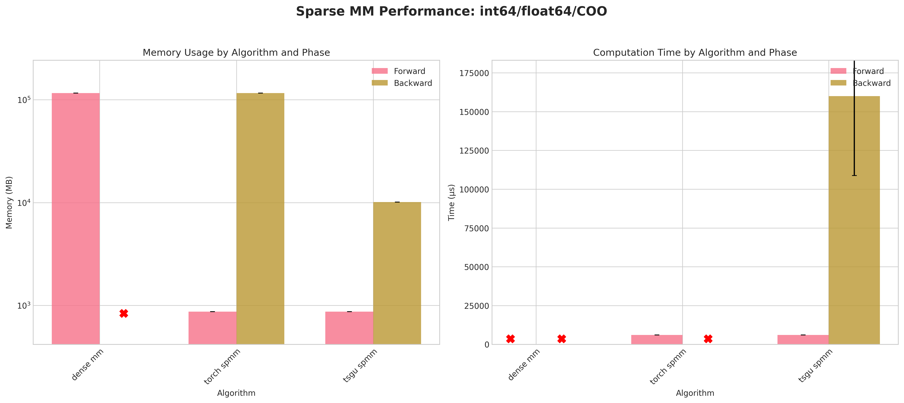

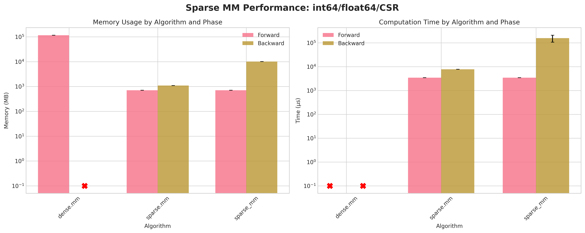

**Conclusions:**

1. Dense baseline (``dense mm``) cannot materialize the 123,440² matrix: attempted allocations ≈58 GB (float32) / ≈116 GB (float64) exceed RTX 4090 memory → forward OOM; no backward possible.
2. ``torch spmm`` with COO layout densifies during backward → identical OOM pattern; CSR backward succeeds and is generally more memory & time efficient for that layout.
3. ``tsgu spmm`` is the only method providing successful backward for COO across all dtype combinations.
4. Using ``int32`` indices yields a consistent small memory reduction versus ``int64`` for COO (e.g. ~493 MB vs ~516 MB forward, float32) despite PyTorch returning indices as ``int64``.
5. For CSR backward, ``torch spmm`` outperforms ``tsgu spmm`` in both time and peak memory; ``tsgu spmm`` incurs extra memory due to internal CSR→COO conversion for gradient computation.
6. ``tsgu spmm`` supports CSR gradients contrary to current public PyTorch documentation statements.
7. Float64 substantially increases runtime variance and lowers throughput, especially in backward, across all surviving methods.

**Recommendations:**

- Use ``tsgu.sparse_mm`` for all COO cases requiring gradients.
- Prefer ``torch.sparse.mm`` for CSR when minimizing backward memory / time and OOM is not an issue.
- Avoid dense fallback for matrices of this scale; prefer sparse pipelines early.

Batched Sparse Matrix Multiplication
~~~~~~~~~~~~~~~~~~~~~~~~~~~~~~~~~~~~~~~~~~~~~~~~~~~~~~~~~~~~~

This benchmark compares batching strategies for performing many independent sparse × dense products. Inputs are randomly generated (not SuiteSparse) to emphasize structural batching overheads.

**Algorithms Compared:**

.. list-table::
   :header-rows: 1
   :widths: 28 47 15

   * - **Code Call**
     - **Description**
     - **Plot Alias**
   * - ``torch.stack([torch.sparse.mm(A[i], B[i]) for i in range(batch)])``
     - List comprehension executing per-item PyTorch sparse @ dense
     - torch list
   * - ``torch.stack([tsgu.sparse_mm(A[i], B[i]) for i in range(batch)])``
     - List comprehension executing per-item tsgu sparse @ dense implementation
     - tsgu list
   * - ``tsgu.sparse_mm(A_batch, B_batch)``
     - Batched variant operating on a block-diagonal sparse assembly under the hood (``sparse_block_diag`` / split helpers)
     - tsgu batched

**Methodology:**

Problem sizes (only the "small" configuration currently enabled):

- ``N = 1024``, ``M = 64`` (dense RHS width)
- ``nnz = 4096`` per sparse matrix (≈0.39% density)
- Batch sizes: 4 and 128 (plots below show batch = 128; batch = 4 results are still stored in the CSV output)

For each combination of index dtype (``int32``/``int64``), value dtype (``float32``/``float64``) and layout (COO/CSR) we generate either:

- A list of ``batch`` independently sampled sparse matrices & dense RHS blocks (for list strategies), or
- A single batched sparse tensor of shape (batch, N, N) plus a batched dense RHS (for the batched variant).

Each algorithm variant is measured with 100 repeats after 10 warmups using the dedicated ``measure_batched_op`` harness which:

- Clones inputs per repetition (ensuring gradient graph isolation)
- Records peak CUDA memory and forward/backward time separately
- Applies IQR outlier filtering before aggregating mean/std
- Handles list vs batched tensor semantics uniformly

**Key Testing Features:**

- Direct comparison of per‑item execution vs block‑diagonal batching.
- Memory trade‑off: batched construction may allocate a larger combined structure vs incremental list execution.
- Gradient inclusion exposes any additional bookkeeping cost in backward for batched mode.
- Layout + dtype interaction tested across 8 (index,value) × 2 layout combinations.
- Random sparsity prevents exploitation of specific matrix ordering.

**Results:**

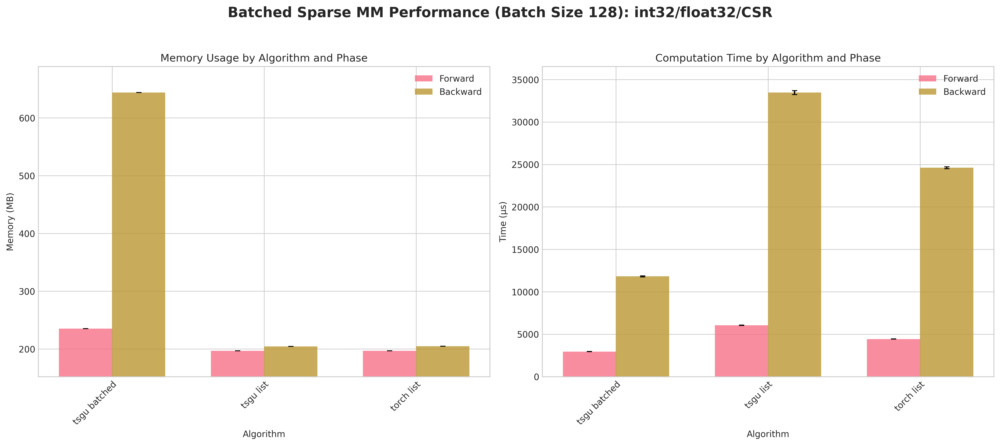

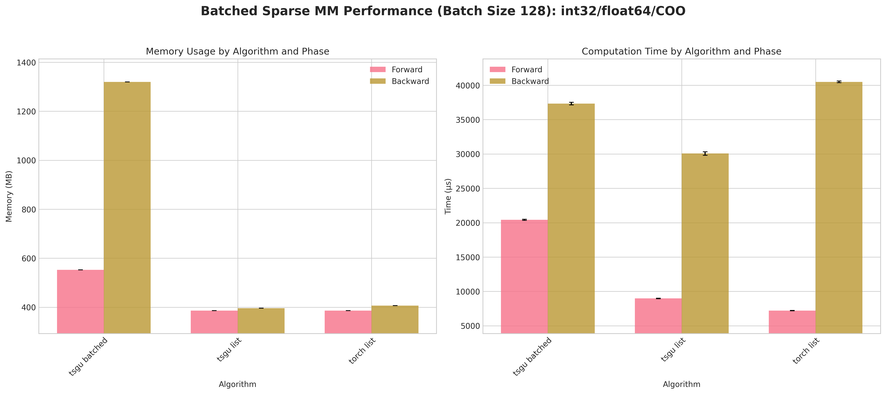

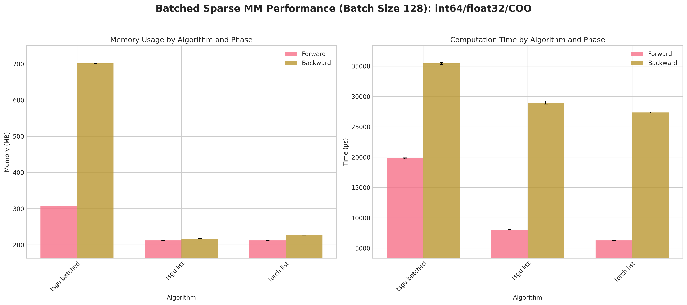

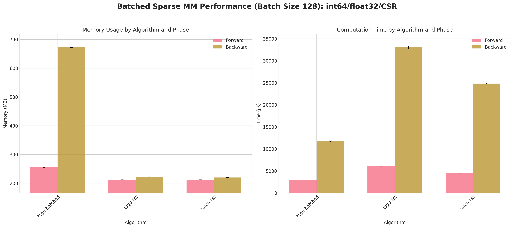

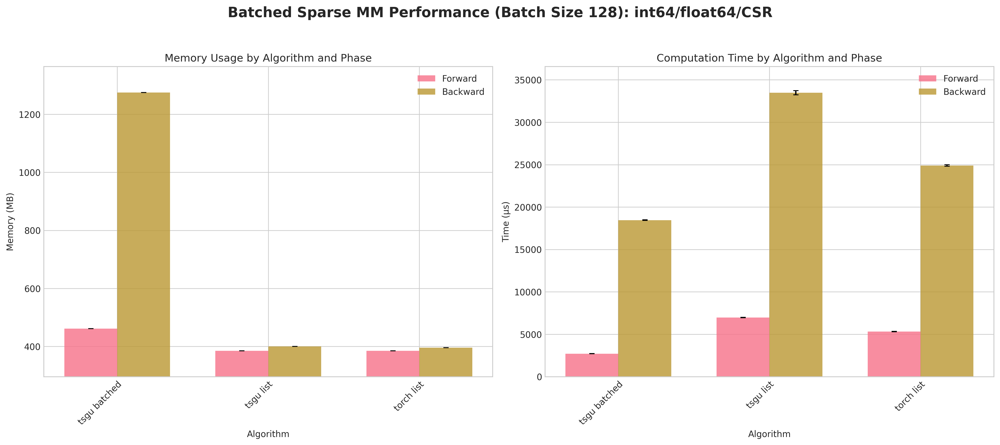

**Conclusions:**

1. ``tsgu batched`` consistently incurs higher peak memory than list strategies because the block‑diagonal assembly materializes all batch blocks simultaneously.
2. A measurable forward/backward speed advantage for ``tsgu batched`` appears primarily for CSR layouts (better internal indexing locality) at large batch size (128).
3. For COO, list strategies (``torch list`` / ``tsgu list``) are typically more memory efficient and competitive in time, making batching less attractive.
4. ``tsgu list`` benefits from the same memory‑efficient kernel as single‑matrix ``tsgu spmm`` while avoiding block concatenation overheads.
5. Float64 again amplifies runtime variance; batching does not mitigate numeric cost.

**Recommendations:**

- Use ``tsgu batched`` only for large batches with CSR when throughput dominates memory concerns.
- Prefer ``tsgu list`` for COO or when peak memory is constrained.
- If gradients are needed and memory is tight, evaluate list strategies first; batching is not universally superior.

Sparse Linear System Solvers
-----------------------------

This benchmark evaluates iterative and direct sparse linear system solvers with gradient computation across PyTorch (dense baseline), torchsparsegradutils native solvers, CuPy/SciPy wrappers, and JAX wrappers.

**Algorithms Compared:**

.. list-table::
   :header-rows: 1
   :widths: 30 45 15

   * - **Code Call**
     - **Description**
     - **Plot Alias**
   * - ``torch.linalg.solve(A.to_dense(), B)``
     - Dense PyTorch reference (LU) – baseline memory/time; expected OOM at this scale
     - Dense
   * - ``tsgu.sparse_generic_solve(A, B, solve=linear_cg)``
     - Conjugate Gradient (tsgu) with sparse gradient support
     - tsgu CG
   * - ``tsgu.sparse_generic_solve(A, B, solve=bicgstab)``
     - BiCGSTAB (tsgu) with symmetric forward/backward wrapper
     - tsgu BiCGSTAB
   * - ``tsgu.sparse_generic_solve(A, B, solve=minres)``
     - MINRES (tsgu) implementation for symmetric systems
     - tsgu MINRES
   * - ``tsgucupy.sparse_solve_c4t(A, B, solve="cg")``
     - CuPy CG via torchsparsegradutils conversion (GPU accelerated)
     - CuPy CG
   * - ``tsgucupy.sparse_solve_c4t(A, B, solve="cgs")``
     - CuPy CGS (CG squared) wrapper
     - CuPy CGS
   * - ``tsgucupy.sparse_solve_c4t(A, B, solve="minres")``
     - CuPy MINRES wrapper
     - CuPy MINRES
   * - ``tsgucupy.sparse_solve_c4t(A, B, solve="gmres")``
     - CuPy GMRES wrapper (restarted algorithm)
     - CuPy GMRES
   * - ``tsgucupy.sparse_solve_c4t(A, B, solve="spsolve")``
     - CuPy direct sparse LU (no tolerance parameters)
     - CuPy spsolve
   * - ``tsgujax.sparse_solve_j4t(A, B, solve=jax.scipy.sparse.linalg.cg)``
     - JAX CG solver (wrapped, consistent tolerances)
     - JAX CG
   * - ``tsgujax.sparse_solve_j4t(A, B, solve=jax.scipy.sparse.linalg.bicgstab)``
     - JAX BiCGSTAB solver (wrapped, consistent tolerances)
     - JAX BiCGSTAB

All iterative solvers use shared convergence settings (relative tol 1e-5, absolute tol 1e-8, max 1000 iterations, no preconditioner). BiCGSTAB uses ``matvec_max = 2 × maxiter`` internally.

**Methodology:**

Matrix: ``Rothberg/cfd2`` (123,440 × 123,440, nnz 3,085,406). Right‑hand side is a single vector (``M=1``) with gradients enabled. For each (index dtype, value dtype, layout) triple we:

- Construct PyTorch sparse tensor (COO then optionally convert to CSR).
- Run each solver with 10 repeats after 1 warmup (``REPEATS=10``, ``WARMUP_RUNS=1``) using the unified ``measure_op`` harness.
- Capture forward/backward time & peak CUDA memory; apply IQR filtering before computing mean/std.
- Compute residual norm ``||A x − B||`` and relative residual ``/ ||B||`` (direct solve residual for ``cupy_spsolve`` may be smallest when successful).
- Record failures (OOM or cusolver errors) with NaN metrics for visualization (plotted as missing / failure markers).

**Key Testing Features:**

- Uniform tolerance configuration across backends for fairness.
- Residual norms reported (accuracy dimension in addition to performance).
- Direct vs iterative solver contrast (``CuPy spsolve`` vs Krylov methods).
- Cross‑backend gradient pathways (PyTorch native vs CuPy vs JAX) under identical statistical treatment.
- Layout + dtype sweep highlights memory scaling; CSR vs COO differences mirror matmul findings.

**Results:**

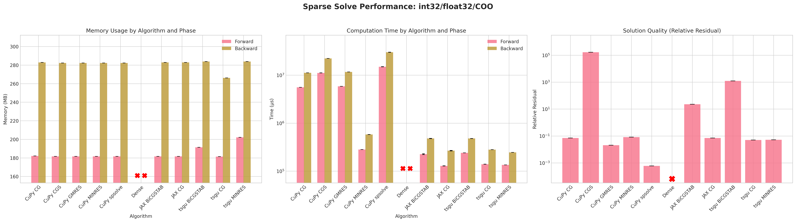

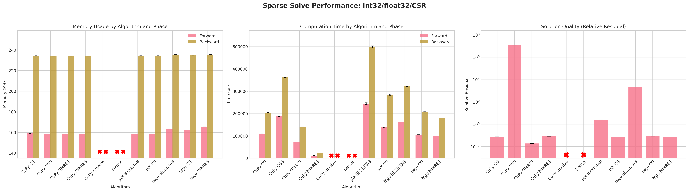

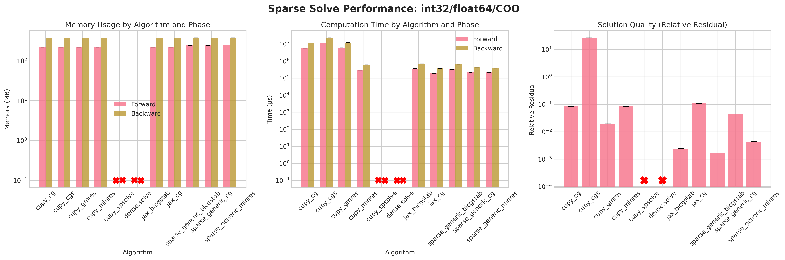

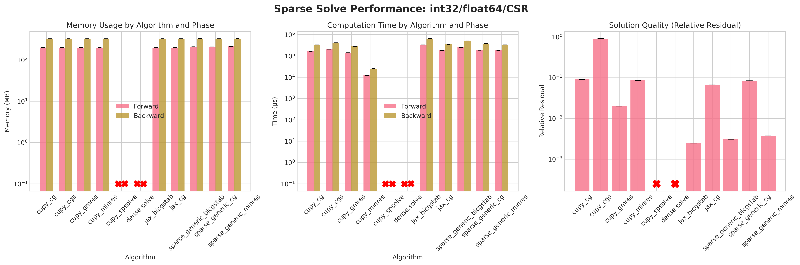

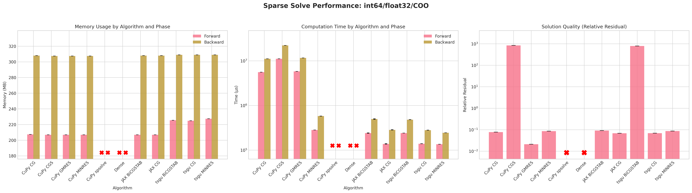

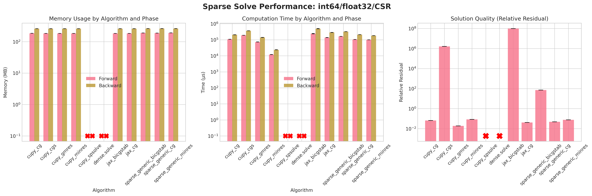

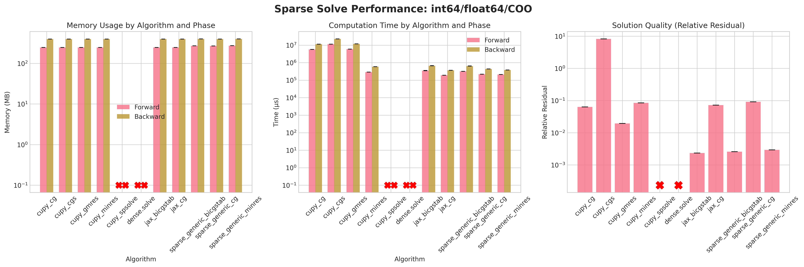

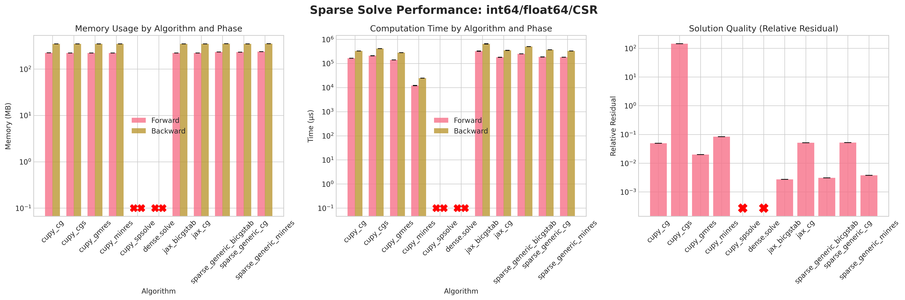

**Conclusions:**

1. The dense PyTorch solver ``torch.linalg.solve`` fails due to out-of-memory (OOM) errors before the forward pass due to failure of creating a dense tensor which would occupy 57GB of CUDA memory.
2. ``torch.sparse_csr`` with ``float32`` and ``int32`` indices is the most memory efficient format for both forward and backward passes.
3. Similar to ``tsgu.sparse_mm``, the ``int32`` indices for ``torch.sparse_coo`` format uses marginally less memory than ``int64`` despite ``A.indices()`` returning ``int64`` indices.
4. All CuPy and JAX solvers use the same amount of memory on the forward and backward pass.
5. The native torchsparsegradutils iterative solvers (CG, BiCGSTAB, MINRES) use marginally more memory on the forward pass, but consistent on the backward pass with other methods.
6. The native torchsparsegradutils iterative solvers (CG, BiCGSTAB, MINRES) are generally faster than the CuPy and JAX implementations for ``torch.sparse_coo`` format, this is likely due to the CuPy solvers converting the sparse matrix to CSR format internally.
7. The CuPy direct solver ``spsolve`` provides the lowest residual, but fails in most cases due to a ``CUSOLVER_STATUS_ALLOC_FAILED`` error, more debugging is required to determine the exact cause.
8. The residuals for CuPy CGS and tsgu BiCGSTAB are significantly higher than other methods, indicating poor convergence behavior, which may be improved with preconditioning or improved convergence parameters.

**Recommendations:**

- The ``tsgu.sparse_generic_solve(A, B, solve=linear_cg)`` methods seems to offer the best balance of speed, memory efficiency, and convergence for large sparse linear systems with gradient computation.

Sparse Triangular Linear System Solvers
---------------------------------------

This benchmark evaluates sparse triangular system solvers with gradient computation using a real-world matrix from the SuiteSparse collection. Unlike the generic linear solves, triangular solves exploit the structure of a (lower or upper) triangular matrix and therefore avoid iterative refinement – they are direct forward (or backward) substitution style operations. The benchmark focuses on memory usage and runtime for both forward and backward passes, and on numerical accuracy via residual norms.

**Algorithms Compared:**

.. list-table::
   :header-rows: 1
   :widths: 28 47 15

   * - **Code Call**
     - **Description**
     - **Plot Alias**
   * - ``torch.triangular_solve(B, A.to_dense(), upper=..., unitriangular=..., transpose=...).solution``
     - Dense PyTorch triangular solve baseline operating on a densified copy of the sparse matrix
     - Dense
   * - ``torch.triangular_solve(B, A, upper=..., unitriangular=..., transpose=...).solution``
     - PyTorch triangular solve on a sparse input tensor (falls back internally as needed)
     - torch
   * - ``tsgu.sparse_triangular_solve(A, B, upper=..., unitriangular=..., transpose=...)``
     - torchsparsegradutils sparse triangular solve with gradient support and memory efficiency
     - tsgu
   * - ``tsgucupy.sparse_solve_c4t(A, B, solve=lambda A_c,B_c: cupy.spsolve_triangular(A_c,B_c, lower=..., unit_diagonal=...))``
     - CuPy triangular solve wrapped for PyTorch tensors (no explicit transpose solve path required here)
     - CuPy

**Methodology:**

Using the same SuiteSparse matrix ``Rothberg/cfd2`` (shape 123,440 × 123,440, nnz 3,085,406; sparsity ~99.98%), we first construct a torch sparse tensor on GPU and then extract only the required triangular portion for benchmarking:

- Lower triangle (including diagonal) is used (``upper=False``) in the current configuration (see source constants ``UPPER=False``, ``UNITRIANGULAR=False``, ``TRANSPOSE=False``).
- For each combination of index dtype (``int32`` / ``int64``), value dtype (``float32`` / ``float64``) and sparse layout (COO / CSR), the triangular mask is applied and a new sparse tensor with only triangular non-zeros is formed.
- A dense right-hand side matrix ``B`` with 2 columns (``M = 2``) is sampled from a standard normal distribution with gradients enabled.
- Each algorithm is timed with 10 repeats (``REPEATS=10``) after a single warmup (``WARMUP_RUNS=1``); outliers (upper / lower IQR) are removed, and mean + std of forward/backward time and memory are recorded using the same measurement utility as earlier sections.
- Residual quality is computed with the triangular matrix actually solved (``A_sparse @ x - B``) to ensure the residual reflects the triangular system, not the original full matrix.

**Key Testing Features:**

- Triangular extraction makes residual norms meaningful and avoids counting unused entries.
- Consistent benchmarking harness shared with other suites (shared timing, memory, and statistical treatment).
- Gradient pass inclusion highlights additional memory overhead or lack thereof.
- Multiple sparse layouts and index/value dtype combinations expose layout and precision trade‑offs.

**Results:**

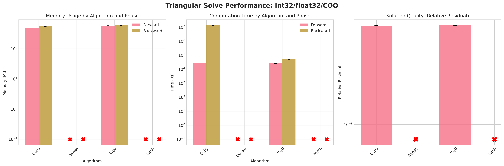

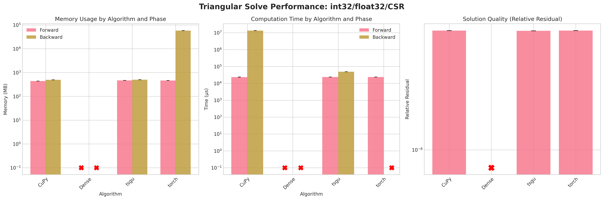
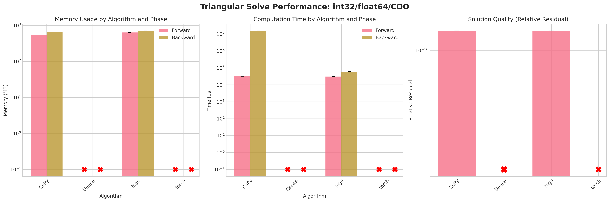

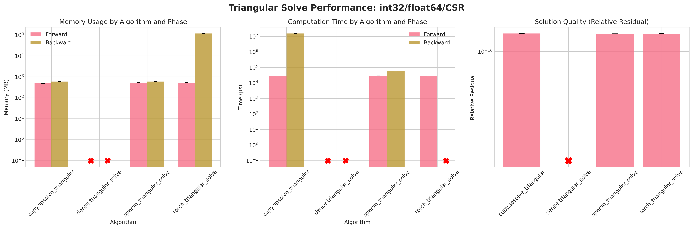

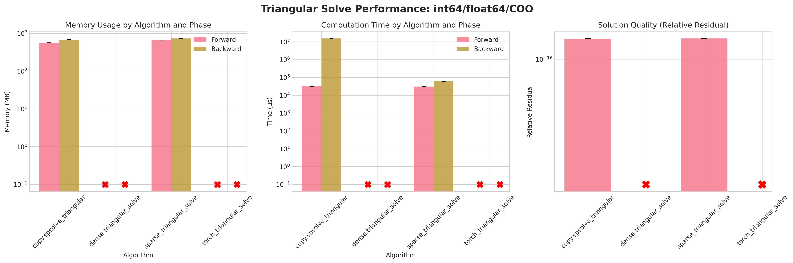

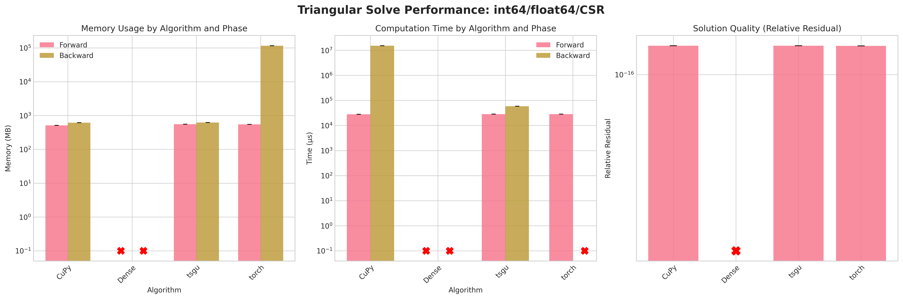

**Conclusions:**

1. Attempting to densify the sparse matrix for ``Dense`` triangular solve leads to OOM errors due to the large memory footprint (≈58 GB for float32, ≈114 GB for float64) on the RTX 4090.
2. ``torch`` sparse triangular solve on COO layout also fails on backward and forward as torch.triangular_solve does not support sparse COO
3. ``torch`` sparse triangular solve on CSR layout succeeds on forward pass but fails on backward pass due to internal densification of gradients.
4. ``CuPy`` triangular solve does provide a sensible memory footprint but has excessive runtime on the backward pass
5. ``tsgu`` triangular solve provides a good balance of memory efficiency and runtime performance on both forward and backward passes.
6. Residuals are neglible due to the direct nature of forward and backward substitution

**Recommendations:**

1. Prefer ``tsgu`` sparse triangular solve in all cases

Reproducing Benchmarks
-----------------------

All benchmarks can be reproduced using our benchmark suite. You can either run all benchmarks at once or run them individually:

**Run all benchmarks:**

.. code-block:: bash

   cd torchsparsegradutils/benchmarks
   python benchmark_suite.py --all
   python visualize_benchmark_results.py

**Run specific benchmarks individually:**

.. code-block:: bash

   # Navigate to benchmark directory
   cd torchsparsegradutils/benchmarks

   # Run specific benchmarks
   python sparse_mm_rand.py              # Random matrix multiplication
   python sparse_mm_suite.py             # SuiteSparse matrix multiplication
   python sparse_generic_solve_rand.py   # Random linear system solving
   python sparse_generic_solve_suite.py  # SuiteSparse linear system solving
   python sparse_triangular_solve_rand.py # Random triangular solving
   python sparse_triangular_solve_suitesparse.py # SuiteSparse triangular
   python batched_sparse_mm_rand.py      # Batched operations

   # Generate visualizations
   python visualize_benchmark_results.py
