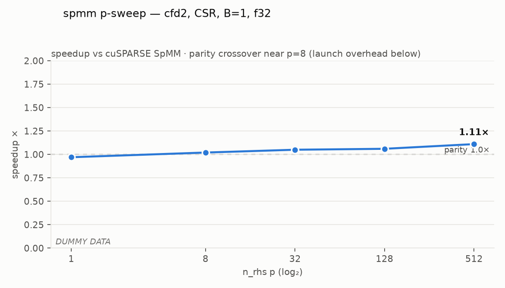
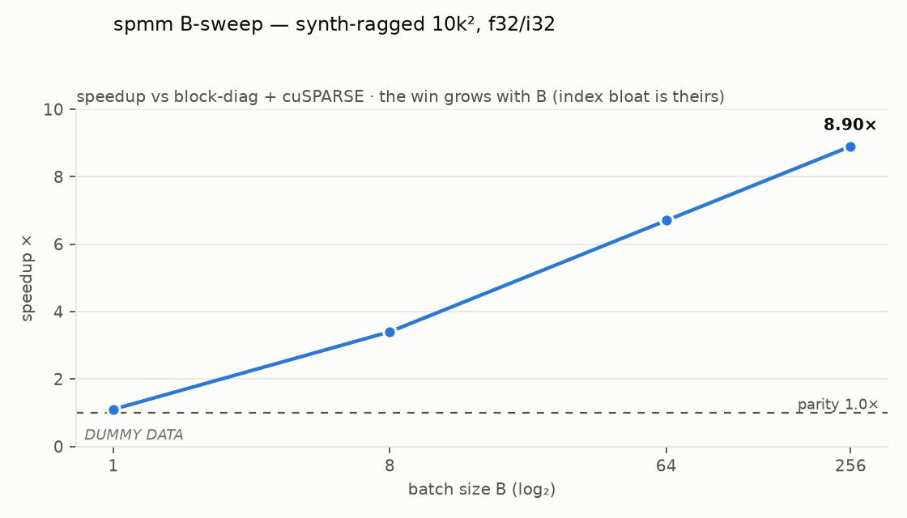
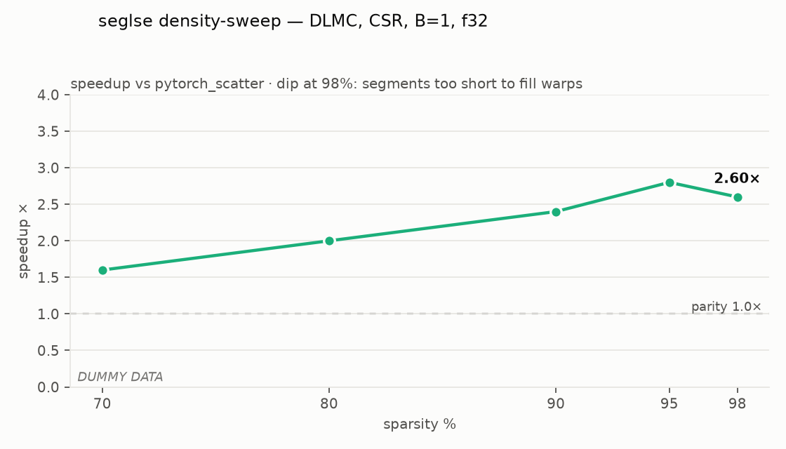
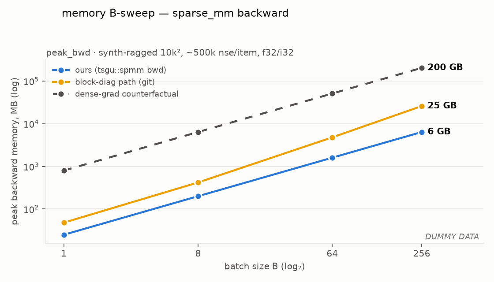

# Benchmarks — proving GOAL.md

Full redo of the `benchmarks/` suite. The old suite's results back the JOSS
paper — they are **not carried forward**; git history (`main` @ f19d7b4,
`benchmarks/results/`) preserves them permanently, and the paper cites a tagged
release. New suite, new protocol, no compatibility constraint.

Testing (testing.md) shares this file's harness fixtures (corpus loaders,
variant matrix, hardware setup) but has no timing infra — it does parity,
gradcheck, opcheck. Benchmarks do timing only; correctness is assumed proven.

## 1. Timing protocol (non-negotiable, applies to every number)

- **Hardware state:** locked clocks (`nvidia-smi -lgc` + persistence mode),
  recorded in every result file header (GPU, driver, CUDA, torch versions,
  clock pin). A result without a header is not a result.
- **L2 flush between iterations** — zero an L2-sized buffer each iteration.
  Sparse kernels are memory-bound; cache-hot numbers are fiction.
- **CUDA-event timing** with do_bench-style windowing: ≥ 25 warmup iterations,
  then measure ≥ 100 iterations or 2000 ms (whichever is longer), report
  **median** + p10/p90. Small-shape guard: back-to-back launch batching so the
  end event isn't CPU-bound (the do_bench small-kernel trap).
- **Aggregation across matrices: geometric mean** of speedups, never arithmetic.
- **Reduced precision:** TF32 off for every parity-relevant number (a labelled
  TF32-on column is allowed for grouped GEMM only). fp16/bf16 rows follow
  kernels.md's half-precision policy — v2 for the throughput families, always
  fp32 accumulation, and compared against cuSPARSE's **half/tensor-core** paths,
  never against its f32 path (that comparison would flatter us dishonestly).
  seglse bf16-storage rows are v1. SpSM/solver half rows don't exist, by policy.
- **Memory is measured alongside time, always** — this library's core claim is
  a memory claim. Per measurement: `reset_peak_memory_stats()` →
  forward → record peak → backward → record peak, in a fresh allocator state
  (`empty_cache()` between configs; caching-allocator reuse would understate).
  Reported: `peak_fwd`, `peak_bwd`, and **workspace** = peak minus tensor
  inputs/outputs — asserted against kernels.md's O(nse)/O(n_rows) bound (a
  kernel that busts its workspace bound fails the suite, same as a wrong
  number).
- **Achieved bandwidth** for the memory-bound families (SpMM, SDDMM, seglse):
  bytes-moved model / median time, reported as % of peak DRAM bandwidth.
  Speedup can flatter a kernel against a weak baseline; %-of-peak says how much
  headroom remains and is the honest metric for memory-bound code.
- **Provenance — no benchmark hacking:** every row records its backend
  (`custom` kernel vs `vendor-scaffold`). Scaffold rows (e.g. a bring-up SpMM
  wrapping cuSPARSE) are excluded from every beat-cuSPARSE claim and geo-mean —
  a vendor call benchmarked against itself proves nothing.
- **Two layers:** op-level (Python, `triton.testing.do_bench`-style harness on
  the public API) and kernel-level (NVBench microbenchmarks in `cuda/bench/`,
  parameter sweeps for tuning). Op-level is the acceptance layer; NVBench is
  for development and regression bisection.

## 2. Corpus

**Migration-period rule:** only the synthetic tier (plus cfd2 strictly as a
reference point) is used while kernels are being built. The SuiteSparse-20 and
DLMC tiers land as their own commit **after** full migration — picking and
pinning real-matrix corpora is release work, not migration work.

| Tier | Contents | Purpose |
|------|----------|---------|
| **Anchor** | Rothberg/cfd2 (continuity with the paper-era suite) | Reference point during migration; anchor row after |
| **SuiteSparse-20** *(post-migration)* | ~20 curated matrices spanning nse 10⁴–10⁸, structured (FEM/banded) vs unstructured (SNAP graphs), tall/square/wide — exact list picked & pinned (name+md5) in its own commit | Headline beat-cuSPARSE evidence |
| **DLMC sample** *(post-migration)* | ~30 matrices from the Deep Learning Matrix Collection (Gale et al.), transformer sparsity 70–98% | ML-shaped sparsity; the regime pytorch_scatter users live in |
| **Synthetic batched/ragged** *(migration workhorse)* | `rand_sparse*` sweep: B ∈ {1, 8, 64, 256}, ragged nse (±50% across items), n ∈ {10³, 10⁴, 10⁵}, int32/int64 | The batched/COO win cases — no public dataset covers this; generator seed pinned |

`n_rhs` (p) swept over {1, 8, 32, 128, 512} — p=1 covers SpMV/solver regime,
p≥128 matches the SpMM literature. Value dtypes: f32/f64 everywhere;
fp16/bf16 join the SpMM/SDDMM/grouped-GEMM sweeps when their v2 tensor-core
paths land (kernels.md).

## 3. Baselines per family

| Family | Baseline(s) | Comparison rule |
|--------|-------------|-----------------|
| SpMM | cuSPARSE `cusparseSpMM` (CSR); block-diag + cuSPARSE for batched | Beat block-diag decisively; ≥ parity vs raw cuSPARSE unbatched |
| SDDMM | cuSPARSE `cusparseSDDMM` unbatched; current pure-PyTorch chain (from git history) as secondary | ≥ parity unbatched; no vendor batched baseline exists — report absolute + vs block-diag |
| seglse(_bidir) | `pytorch_scatter.scatter_logsumexp` on equivalent index arrays; old pure-PyTorch path | Beat both; bidir additionally ≥ 1.5× over two single-dim calls (else the fused op has no reason to exist) |
| SpSM | cuSPARSE `cusparseSpSM` incl. its analysis cost amortisation | ≥ parity cold; win warm (plan cached on descriptor) |
| Grouped GEMM | cuBLAS `cublasGemmGroupedBatched`; DGL `segment_mm` if installable | ≥ parity |
| coo2csr | cuSPARSE `Xcoo2csr` + thrust sort | ≥ parity |

**Memory bars** (in addition to the speed bars above):

- Backward of every §1 op: peak ≤ small-constant × (inputs + outputs + O(nse));
  the dense-gradient counterfactual (`n·m` materialisation) is reported
  alongside as the "what we save you" column — that ratio is the library's
  headline.
- Batched ops: peak memory must beat the block-diag path (which duplicates and
  offsets index arrays) at every B in the sweep.
- e2e rsample: the encoder-CSR backward blow-up documented in the old README is
  a pinned regression case — peak_bwd ≤ 1.2× the COO path's, or the suite fails.

End-to-end composites (rsample of `SparseMultivariateNormal`, CG solve loop)
get one benchmark each — the user-visible number, catching dispatch overhead
that per-op benchmarks hide.

## 4. Regression gating (benchmarks as CI)

- **During migration: JSON only, no dashboards.** Every run persists one JSON
  file (fields = §5 schema) under `benchmarks/results/`; the viz script reads
  those. Dashboard/trend tooling (Bencher / github-action-benchmark pages) is a
  post-migration decision.
- **Runner: this dev machine** for the whole migration (locked clocks per §1;
  machine fingerprint in every result header). Dedicated/self-hosted CI runner
  is a post-migration decision.
- **PR gate:** the op-level suite's anchor subset (cfd2 + 4 synthetic configs —
  minutes, not hours); fail PR on >10% median regression vs main, compared
  against the stored JSONs.
- Acceptance-bar rows (§3) are asserted whenever the full suite runs: a ❌ on a
  bar the spec claims is met fails loudly.

## 5. Result schema & what the table looks like

Result schema (one record per measurement; persisted as JSON during migration):
`op, family, backend(custom|vendor-scaffold), variant(layout/batch/dtypes),
matrix, n, m, nse, p, baseline_name, baseline_ms, ours_ms, speedup,
peak_fwd_mb, peak_bwd_mb, workspace_mb, bw_pct_peak, mem_bar_met, bar, bar_met,
gpu, clocks, torch, cuda, commit, date`

Rendered table — **⚠ DUMMY VALUES, illustration of shape only** (real numbers
land with the first kernel benchmarks):

| Op (`tsgu::`) | Variant | Matrix | n / m | nse | p | Baseline | Base ms | Ours ms | Speedup | Bar | Met |
|---------------|---------|--------|-------|-----|---|----------|--------:|--------:|--------:|-----|-----|
| `spmm` | CSR·B=1·f32/i32 | cfd2 | 123k² | 3.09M | 128 | cuSPARSE SpMM | 1.82 | 1.71 | 1.06× | ≥1.0× | ✅ |
| `spmm` | CSR·B=64·f32/i32 | synth-ragged | 10k² | ~500k/item | 32 | block-diag+cuSPARSE | 41.3 | 6.2 | 6.7× | win | ✅ |
| `spmm` | COO·B=1·f32/i64 | SNAP/soc-Epinions1 | 76k² | 509k | 128 | cuSPARSE SpMM(coo) | 0.94 | 0.88 | 1.07× | ≥1.0× | ✅ |
| `sddmm` | CSR·B=1·f32/i32 | cfd2 | 123k² | 3.09M | 128 | cuSPARSE SDDMM | 2.10 | 1.98 | 1.06× | ≥1.0× | ✅ |
| `sddmm` | CSR·B=64·f64/i64 | synth-ragged | 10k² | ~500k/item | 32 | block-diag path | 88.7 | 11.9 | 7.5× | win | ✅ |
| `seglse` | CSR·B=1·f32/i32 | DLMC/transformer-90% | 512×33k | 1.6M | — | pytorch_scatter | 0.71 | 0.29 | 2.4× | win | ✅ |
| `seglse` | CSR·B=1·f32/i32 | DLMC/transformer-90% | 512×33k | 1.6M | — | old pure-torch (git) | 3.4 | 0.29 | 11.7× | win | ✅ |
| `seglse_bidir` | CSR·B=8·f32/i32 | synth | 10k² | 1M/item | — | 2× `seglse` | 0.64 | 0.35 | 1.8× | ≥1.5× | ✅ |
| `spmm` (v2) | CSR·B=1·bf16/i32·f32-acc | DLMC/transformer-95% | 512×33k | 0.8M | 256 | cuSPARSE SpMM bf16 (TC) | 0.29 | 0.31 | 0.94× | ≥1.0× (v2) | ❌ |
| `seglse` | CSR·B=1·bf16-store/f32-acc | DLMC/transformer-90% | 512×33k | 1.6M | — | pytorch_scatter (bf16) | 0.66 | 0.27 | 2.4× | win | ✅ |
| `spsm` (cold) | CSR·B=1·f32/i32 | cfd2-tril | 123k² | 1.6M | 8 | cuSPARSE SpSM | 3.95 | 4.02 | 0.98× | ≥1.0× | ❌ |
| `spsm` (warm) | CSR·B=1·f32/i32 | cfd2-tril | 123k² | 1.6M | 8 | cuSPARSE SpSM | 3.95 | 1.44 | 2.7× | win | ✅ |
| `grouped_gemm` | f32·TF32-off | synth GNN (seg=1k) | 15k×256 | — | 256 | cuBLAS grouped | 0.52 | 0.49 | 1.06× | ≥1.0× | ✅ |
| `coo2csr` | B=1·i32 | SNAP/soc-Epinions1 | 76k² | 509k | — | thrust+Xcoo2csr | 0.11 | 0.10 | 1.10× | ≥1.0× | ✅ |
| e2e `rsample` | CSR·B=2·f32 | encoder 4×64³ | 1.05M² | 5.2M | — | current main (git) | 96.0 | 14.8 | 6.5× | win | ✅ |
| geo-mean (vendor-baseline rows) | | | | | | | | | **1.06×** | ≥1.0× | ✅ |
| geo-mean (batched/fused rows) | | | | | | | | | **4.9×** | win | ✅ |

The ❌ rows are deliberate: cold-SpSM parity is expected to be hard (cuSPARSE's
analysis is good — the spec's claim is the *warm* row), and the bf16 row shows
the v2 tensor-core bar honestly pending. A table with no ❌ is a table nobody
stress-tested.

Memory companion table — **⚠ DUMMY VALUES**; `dense grad` = the `n·m`
materialisation counterfactual the sparse gradient avoids:

| Op | Variant | Matrix | peak_fwd | peak_bwd | dense grad would be | saving | workspace | O(nse) bound | BW % peak |
|----|---------|--------|---------:|---------:|--------------------:|-------:|----------:|:---:|---:|
| `sparse_mm` bwd | CSR·B=1·f32/i32 | cfd2 | 187 MB | 214 MB | 60.5 GB | 283× | 24.7 MB | ✅ | 71% |
| `sparse_mm` bwd | CSR·B=64·f32/i32 | synth-ragged | 1.3 GB | 1.6 GB | — (OOM) | ∞ | 260 MB | ✅ | 68% |
| `sparse_mm` bwd | (block-diag path, git) | synth-ragged B=64 | 2.9 GB | 4.8 GB | — | — | 1.9 GB | ❌ | — |
| `seglse` bwd | CSR·B=1·f32/i32 | DLMC-90% | 14 MB | 21 MB | 67 MB | 3.2× | 6.4 MB | ✅ | 83% |
| e2e `rsample` | encoder CSR·B=2 | 4×64³ | 2.1 GB | 2.4 GB | — | — | — | ✅ | — |
| e2e `rsample` | encoder COO·B=2 (ref) | 4×64³ | 2.1 GB | 2.2 GB | — | — | — | ✅ | — |

(The block-diag row shows *why* it dies: 1.9 GB of duplicated, offset index
workspace against our 260 MB. The rsample CSR row passing at ≤1.2× COO is the
pinned regression for the old README's blow-up.)

## 6. Sweep charts

The table is the record; **sweeps are the argument** — a single-point win says
nothing about where a kernel's regime starts and ends. The suite's viz script
(successor of `visualize_benchmark_results.py`) renders the chart set below
from the CSV. Chart rules: log₂ x-axes, y = speedup vs named baseline with a
parity line at 1.0×, one hue per kernel family (fixed assignment, never
recycled), no dual axes, endpoint direct-labelled, dark/light both rendered.

| Chart | x (log₂) | y | One line per | Question it answers |
|-------|----------|---|--------------|---------------------|
| p-sweep | p ∈ {1…512} | speedup vs cuSPARSE | matrix (small multiples per family) | Where does the win start/stop as RHS width grows? |
| B-sweep | B ∈ {1…256} | speedup vs block-diag+cuSPARSE | synthetic config | Does the batching win scale or saturate? |
| nse-sweep | nse 10⁴–10⁸ | speedup vs baseline | p value | Are we winning on small problems and losing on large (or inverse)? |
| density-sweep (seglse) | sparsity 70–98% | speedup vs pytorch_scatter | layout | Which sparsity regime is ours? |
| distribution strip | — | per-matrix speedup, geo-mean marked | corpus tier | Is the geo-mean hiding losers? |
| memory B-sweep | B ∈ {1…256} | peak_bwd (log₂ y) | path (ours / block-diag / dense counterfactual) | Does memory stay O(nse) while theirs grows? |

In-spec sketches (**dummy values** — generated by
[`images/make_dummy_charts.py`](images/make_dummy_charts.py), run with
`uv run --with matplotlib python make_dummy_charts.py`; the real suite's
renders replace these from CSV):

Reading the dummies as intended: p-sweep crosses parity near p=8 (below that,
launch overhead dominates — an honest chart shows it); B-sweep is the headline
curve (the win *grows* with B because block-diag's index bloat grows); the
seglse curve dips at 98% because segments get too short to fill warps — the
kind of regime edge only a sweep exposes.

## 7. Open questions

None during migration.

Deferred to post-migration commits: SuiteSparse-20 matrix list (pick once, pin
by name+md5, never rotate); dedicated GPU runner; dashboards (JSON-only until
then).

Resolved: NVBench microbenchmarks are **day-one** — each kernel's `.cu` lands
with an NVBench target in `cuda/bench/` (parameter axes = the kernel's tuning
knobs). Rationale: tuning starts with the first kernel, not later; and when the
op-level number regresses, kernel-level vs op-level is what separates a kernel
regression from wrapper/dispatch overhead. Op-level remains the acceptance
layer; NVBench never gates. Runner during migration = this dev machine.
Provenance rule (§1) resolves the SpMM-scaffold sequencing question.
