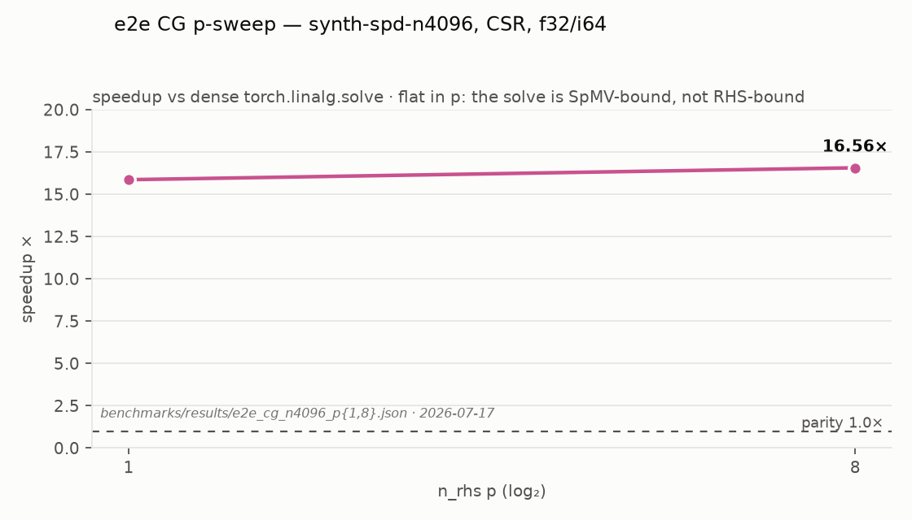
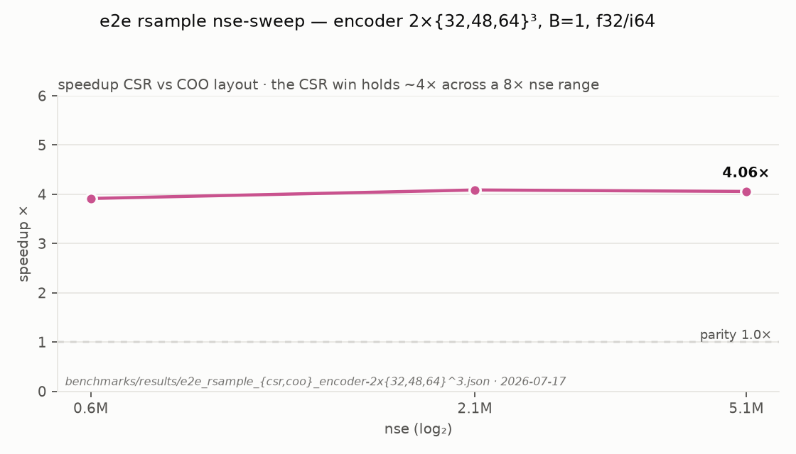
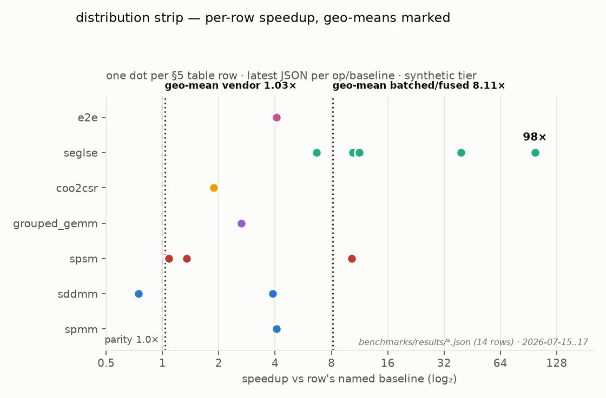
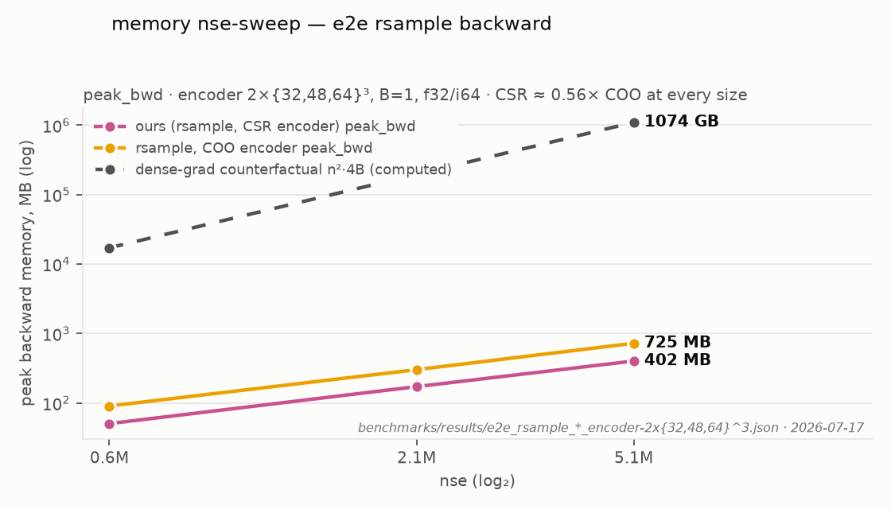

# Benchmarks — proving GOAL.md

Full redo of the `benchmarks/` suite. The old suite's results back the JOSS
paper — they are **not carried forward**; git history (`main` @ f19d7b4,
`benchmarks/results/`) preserves them permanently, and the paper cites a tagged
release. New suite, new protocol, no compatibility constraint.

Testing (testing.md) shares this file's harness fixtures (corpus loaders,
variant matrix, hardware setup) but has no timing infra — it does parity,
gradcheck, opcheck. Benchmarks do timing only; correctness is assumed proven.

## 1. Timing protocol (non-negotiable, applies to every number)

- **Hardware state:** locked clocks (`nvidia-smi -lgc` + persistence mode),
  recorded in every result file header (GPU, driver, CUDA, torch versions,
  clock pin). A result without a header is not a result.
- **L2 flush between iterations** — zero an L2-sized buffer each iteration.
  Sparse kernels are memory-bound; cache-hot numbers are fiction.
- **CUDA-event timing** with do_bench-style windowing: ≥ 25 warmup iterations,
  then measure ≥ 100 iterations or 2000 ms (whichever is longer), report
  **median** + p10/p90. Small-shape guard: back-to-back launch batching so the
  end event isn't CPU-bound (the do_bench small-kernel trap).
- **Aggregation across matrices: geometric mean** of speedups, never arithmetic.
- **Reduced precision:** TF32 off for every parity-relevant number (a labelled
  TF32-on column is allowed for grouped GEMM only). fp16/bf16 rows follow
  kernels.md's half-precision policy — v2 for the throughput families, always
  fp32 accumulation, and compared against cuSPARSE's **half/tensor-core** paths,
  never against its f32 path (that comparison would flatter us dishonestly).
  seglse bf16-storage rows are v1. SpSM/solver half rows don't exist, by policy.
- **Memory is measured alongside time, always** — this library's core claim is
  a memory claim. Per measurement: `reset_peak_memory_stats()` →
  forward → record peak → backward → record peak, in a fresh allocator state
  (`empty_cache()` between configs; caching-allocator reuse would understate).
  Reported: `peak_fwd`, `peak_bwd`, and **workspace** = peak minus tensor
  inputs/outputs — asserted against kernels.md's O(nse)/O(n_rows) bound (a
  kernel that busts its workspace bound fails the suite, same as a wrong
  number).
- **Achieved bandwidth** for the memory-bound families (SpMM, SDDMM, seglse):
  bytes-moved model / median time, reported as % of peak DRAM bandwidth.
  Speedup can flatter a kernel against a weak baseline; %-of-peak says how much
  headroom remains and is the honest metric for memory-bound code.
- **Provenance — no benchmark hacking:** every row records its backend
  (`custom` kernel vs `vendor-scaffold`). Scaffold rows (e.g. a bring-up SpMM
  wrapping cuSPARSE) are excluded from every beat-cuSPARSE claim and geo-mean —
  a vendor call benchmarked against itself proves nothing.
- **Two layers:** op-level (Python, `triton.testing.do_bench`-style harness on
  the public API) and kernel-level (NVBench microbenchmarks in `cuda/bench/`,
  parameter sweeps for tuning). Op-level is the acceptance layer; NVBench is
  for development and regression bisection.

## 2. Corpus

**Migration-period rule:** only the synthetic tier (plus cfd2 strictly as a
reference point) is used while kernels are being built. The SuiteSparse-20 and
DLMC tiers land as their own commit **after** full migration — picking and
pinning real-matrix corpora is release work, not migration work.

| Tier | Contents | Purpose |
|------|----------|---------|
| **Anchor** | Rothberg/cfd2 (continuity with the paper-era suite) | Reference point during migration; anchor row after |
| **SuiteSparse-20** *(post-migration)* | ~20 curated matrices spanning nse 10⁴–10⁸, structured (FEM/banded) vs unstructured (SNAP graphs), tall/square/wide — exact list picked & pinned (name+md5) in its own commit | Headline beat-cuSPARSE evidence |
| **DLMC sample** *(post-migration)* | ~30 matrices from the Deep Learning Matrix Collection (Gale et al.), transformer sparsity 70–98% | ML-shaped sparsity; the regime pytorch_scatter users live in |
| **Synthetic batched/ragged** *(migration workhorse)* | `rand_sparse*` sweep: B ∈ {1, 8, 64, 256}, ragged nse (±50% across items), n ∈ {10³, 10⁴, 10⁵}, int32/int64 | The batched/COO win cases — no public dataset covers this; generator seed pinned |

`n_rhs` (p) swept over {1, 8, 32, 128, 512} — p=1 covers SpMV/solver regime,
p≥128 matches the SpMM literature. Value dtypes: f32/f64 everywhere;
fp16/bf16 join the SpMM/SDDMM/grouped-GEMM sweeps when their v2 tensor-core
paths land (kernels.md).

## 3. Baselines per family

| Family | Baseline(s) | Comparison rule |
|--------|-------------|-----------------|
| SpMM | cuSPARSE `cusparseSpMM` (CSR); block-diag + cuSPARSE for batched | Beat block-diag decisively; ≥ parity vs raw cuSPARSE unbatched |
| SDDMM | cuSPARSE `cusparseSDDMM` unbatched; current pure-PyTorch chain (from git history) as secondary | ≥ parity unbatched; no vendor batched baseline exists — report absolute + vs block-diag |
| seglse(_bidir) | `pytorch_scatter.scatter_logsumexp` on equivalent index arrays; old pure-PyTorch path | Beat both; bidir additionally ≥ 1.5× over two single-dim calls (else the fused op has no reason to exist) |
| SpSM | cuSPARSE `cusparseSpSM` incl. its analysis cost amortisation | ≥ parity cold; win warm (plan cached on descriptor) |
| Grouped GEMM | cuBLAS `cublasGemmGroupedBatched`; DGL `segment_mm` if installable | ≥ parity |
| coo2csr | cuSPARSE `Xcoo2csr` + thrust sort | ≥ parity |

**Memory bars** (in addition to the speed bars above):

- Backward of every §1 op: peak ≤ small-constant × (inputs + outputs + O(nse));
  the dense-gradient counterfactual (`n·m` materialisation) is reported
  alongside as the "what we save you" column — that ratio is the library's
  headline.
- Batched ops: peak memory must beat the block-diag path (which duplicates and
  offsets index arrays) at every B in the sweep.
- e2e rsample: the encoder-CSR backward blow-up documented in the old README is
  a pinned regression case — peak_bwd ≤ 1.2× the COO path's, or the suite fails.

End-to-end composites (rsample of `SparseMultivariateNormal`, CG solve loop)
get one benchmark each — the user-visible number, catching dispatch overhead
that per-op benchmarks hide.

## 4. Regression gating (benchmarks as CI)

- **During migration: JSON only, no dashboards.** Every run persists one JSON
  file (fields = §5 schema) under `benchmarks/results/`; the viz script reads
  those. Dashboard/trend tooling (Bencher / github-action-benchmark pages) is a
  post-migration decision.
- **Runner: this dev machine** for the whole migration (locked clocks per §1;
  machine fingerprint in every result header). Dedicated/self-hosted CI runner
  is a post-migration decision.
- **PR gate:** the op-level suite's anchor subset (cfd2 + 4 synthetic configs —
  minutes, not hours); fail PR on >10% median regression vs main, compared
  against the stored JSONs.
- Acceptance-bar rows (§3) are asserted whenever the full suite runs: a ❌ on a
  bar the spec claims is met fails loudly.

## 5. Result schema & what the table looks like

Result schema (one record per measurement; persisted as JSON during migration):
`op, family, backend(custom|vendor-scaffold), variant(layout/batch/dtypes),
matrix, n, m, nse, p, baseline_name, baseline_ms, ours_ms, speedup,
peak_fwd_mb, peak_bwd_mb, workspace_mb, bw_pct_peak, mem_bar_met, bar, bar_met,
gpu, clocks, torch, cuda, commit, date`

Rendered table — **real data** (commit 20 revalidation): one row per
op/variant from the latest JSON per op under `benchmarks/results/`, measured
2026-07-15 → 2026-07-17 on the migration dev machine (§4): NVIDIA RTX A1000
Laptop GPU, torch 2.13.0+cu130, CUDA 13.0, host `sie209-lap`. **Confound,
carried in every JSON header:** clocks were **not** locked — the harness runs
without root, so §1's `-lgc` pin is not enforced; headers record the
nvidia-smi-queried sm/mem clocks per run instead (210–1717 MHz sm across these
files), so cross-file comparisons inherit clock jitter. Corpus = synthetic
tier only, per §2's migration rule. All rows are `backend=custom` — there are
no vendor-scaffold rows to exclude from the geo-means.

| Op (`tsgu::`) | Variant | Matrix | n / m | nse | p | Baseline | Base ms | Ours ms | Speedup | Bar | Met |
|---------------|---------|--------|-------|-----|---|----------|--------:|--------:|--------:|-----|-----|
| `seglse` | CSR·B=1·f32/i32 | synth-dlmc90 | 4096² | 1.68M | — | `pytorch_scatter.scatter_logsumexp` | 5.24 | 0.053 | 98.0× | win | ✅ |
| `seglse` | CSR·B=1·f32/i32 | synth-dlmc90 | 4096² | 1.68M | — | oracle-A (old pure-torch, git) | 2.10 | 0.053 | 39.3× | win | ✅ |
| `seglse_bidir` | CSR·B=1·f32/i32 | synth-dlmc90 | 4096² | 1.68M | — | 2× `tsgu::seglse` (dim-0 + dim-1) | 13.07 | 1.25 | 10.4× | ≥1.5× | ✅ |
| `seglse_bidir` | CSR·B=1·f32/i32 | synth-dlmc90 | 4096² | 1.68M | — | `pytorch_scatter` (2×, row+col) | 14.12 | 1.25 | 11.3× | win | ✅ |
| `seglse_bidir` | CSR·B=1·f32/i32 | synth-dlmc90 | 4096² | 1.68M | — | oracle-A (old pure-torch bidir, git) | 8.36 | 1.25 | 6.7× | win | ✅ |
| `sddmm` | CSR·B=1·f32/i32 | synth-dlmc90 | 4096² | 1.68M | 128 | cuSPARSE SDDMM | 8.10 | 3.36 | 2.41× | ≥1.0× | ✅ |
| `sddmm` | CSR·B=8·f64/i64 | synth-ragged | 1024² | 42.0k | 32 | pure-torch index_select chain (block-diag equivalent) | 0.95 | 0.24 | 3.9× | win | ✅ |
| `spmm` | CSR·B=8·f64/i64 | synth-ragged | 1024² | 41.9k | 32 | block-diag + cuSPARSE | 0.26 | 0.06 | 4.1× | win | ✅ |
| `spsm` (cold) | CSR·B=1·f32/i32 | synth-banded | 4096² | 36.8k | 8 | cuSPARSE SpSM | 15.69 | 14.48 | 1.08× | ≥1.0× | ✅ |
| `spsm` (warm) | CSR·B=1·f32/i32 | synth-banded | 4096² | 36.8k | 8 | cuSPARSE SpSM | 15.69 | 11.63 | 1.35× | win | ✅ |
| `spsm` (batched) | CSR·B=8·f64/i64 | synth-banded | 1024² | 57.2k | 8 | looped cuSPARSE SpSM (per item) | 40.30 | 3.92 | 10.3× | win | ✅ |
| `grouped_gemm` | gather_mm·bwd·f32/i64·TF32-off | synth-random-idx | 4096×64·R=4 | — | 64 | per-segment cuBLAS GEMM loop | 0.95 | 0.36 | 2.6× | ≥1.0× | ✅ |
| `grouped_gemm` | segment-shape parity | — | — | — | — | cuBLAS `cublasGemmGroupedBatched` | — | — | 0.5–0.8× | ≥1.0× | ❌ |
| `coo2csr` | COO·B=16·i64 | synth-uniform | 4096² | 5.00M | — | pure-torch two-pass argsort + compress | 34.83 | 18.48 | 1.9× | win | ✅ |
| e2e `rsample` | encoder CSR·B=1·f32/i64·S=32 | 2×64³ | 524k² | 5.12M | — | same-config COO path | 77.04 | 18.99 | 4.1× | — | — |
| e2e CG | CSR·f32/i64·p=1 | synth-spd-n4096 | 4096² | 88.0k | 1 | dense `torch.linalg.solve` | 49.26 | 3.11 | 15.9× | n/a | — |
| e2e CG | CSR·f32/i64·p=8 | synth-spd-n4096 | 4096² | 88.0k | 8 | dense `torch.linalg.solve` | 52.98 | 3.20 | 16.6× | n/a | — |
| e2e CG | CSR·f32/i64·p=1 | synth-spd-n16384 | 16384² | 1.36M | 1 | — (absolute only) | — | 6.57 | — | — | — |
| e2e CG | CSR·f32/i64·p=8 | synth-spd-n16384 | 16384² | 1.36M | 8 | — (absolute only) | — | 13.36 | — | — | — |
| geo-mean (vendor-baseline rows) | | | | | | | | | **1.52×** | ≥1.0× | ✅ |
| geo-mean (batched/fused rows) | | | | | | | | | **8.11×** | win | ✅ |

Geo-mean membership (geometric mean per §1): *vendor-baseline* = the rows
whose baseline is a single like-for-like vendor call — sddmm B=1, spsm cold,
spsm warm (n=3). *batched/fused* = the win-bar rows against composite/looped/
legacy baselines — spmm B=8, sddmm B=8, spsm batched, grouped_gemm vs mm-loop,
coo2csr, the two seglse rows, the three seglse_bidir rows, e2e rsample CSR vs
COO (n=11). Excluded from both: the grouped_gemm segment-shape parity row (its
0.5–0.8× is `map.md`'s routing-table record from the commit-18 perf pass — no
JSON in `results/` carries a single number for it) and the e2e CG rows (dense
`torch.linalg.solve` is not a §3 bar baseline; bar recorded `n/a`).

The ❌ row is real, not decorative: the grouped_gemm segment-shape
cuBLAS-parity bar is still open (`map.md`: 0.5–0.8× after the register-blocked
pass; follow-up is vectorised LDS.128 + double buffering). The unbatched sddmm
row was re-measured for this table after the `f69990d` row-tiled perf pass
(the previously persisted JSON pre-dated it, recording 0.75× at `dc7eb31`)
and now clears its bar at 2.41×. (Cold spsm, the dummy table's expected ❌,
clears its bar at 1.08× after `e62183d`'s sync-free single-launch solve — an
earlier n=8192 pre-fix file recording 0.48× is superseded.)

Row provenance (`benchmarks/results/`): seglse rows =
`seglse_custom_20260715T052716070439+0000_row{0,1}.json`; seglse_bidir rows =
`seglse_bidir_vs_{2x_seglse,pytorch_scatter,oracle}.json`; sddmm rows =
`sddmm_custom_20260717T191858311400+0000.json (unbatched, re-run post-f69990d) and
`sddmm_custom_20260716T155529170866+0000.json` (batched)`; spmm =
`spmm_custom_20260716T171149781803+0000.json`; spsm cold/warm/batched =
`spsm_{cold,warm,batched}_custom_20260716T184319519807+0000.json`;
grouped_gemm = `grouped_gemm_custom_20260717T174200830899+0000.json` (parity
row: `map.md` kernel-routing table, no JSON); coo2csr =
`coo2csr_custom_20260717T180049584105+0000.json`; e2e rsample =
`e2e_rsample_{csr,coo}_encoder-2x64^3.json`; e2e CG =
`e2e_cg_n{4096,16384}_p{1,8}.json`.

Memory companion table — **real data**; per-op rows re-measured 2026-07-17
with the backward-instrumented harness (`benchmarks/memory.py`): each per-op
row runs the raw op's forward **under autograd** on differentiable leaf
operands and a sum-style-loss backward (upstream grad materialised as
`ones_like`), per §1's reset → forward → record → backward → record protocol,
with generator scaffolding freed first so the allocator peak is the op's own.
`dense grad` = the dense-materialisation counterfactual computed from the
row's shape (`B·n·m·itemsize` bytes; = `n·m·4` for unbatched f32), never
measured; `saving` = dense grad ÷ peak_bwd, where a dense-grad counterfactual
applies; `workspace` = max-phase peak minus tensor inputs/outputs (gradient
buffers counted as backward outputs); `O(nse) bound` = the recorded
`workspace_bound_met` verdict — workspace ≤ 16 × the op's O(nse)+O(n_rows)
byte size (`benchmarks/memory.py` `WORKSPACE_BOUND_FACTOR`; recorded per row,
not yet suite-failing during migration); `BW % peak` = §1's
achieved-bandwidth metric — compulsory-traffic bytes-moved model (values +
indices read once, each dense operand read once, output written once — a
lower bound for gather-heavy SDDMM) over the §1 median, as % of the RTX
A1000's 176 GB/s peak DRAM bandwidth (`PEAK_DRAM_BANDWIDTH_GB_S`), modelled
for the three memory-bound families SpMM/SDDMM/seglse only. `—` means not
applicable: coo2csr has no backward (index-only op — `peak_bwd` is `null` in
its JSONs by design), solve/convert rows carry no dense-grad counterfactual,
BW % peak exists only for the three modelled families, and the e2e composite
rows (unchanged commit-20 measurements) assert no per-kernel bound:

| Op | Variant | Matrix | peak_fwd | peak_bwd | dense grad would be | saving | workspace | O(nse) bound | BW % peak |
|----|---------|--------|---------:|---------:|--------------------:|-------:|----------:|:---:|---:|
| `sddmm` | CSR·B=1·f32/i32 | synth-dlmc90 | 21.2 MB | 135.2 MB | 67.1 MB | 0.5× | 104.0 MB | ✅ | 2.8% |
| `sddmm` | CSR·B=8·f64/i64 | synth-ragged | 8.7 MB | 14.7 MB | 67.1 MB | 4.4× | 1.7 MB | ✅ | 11.4% |
| `spmm` | CSR·B=8·f64/i64 | synth-ragged | 7.1 MB | 13.1 MB | 67.1 MB | 4.9× | 1.7 MB | ✅ | 43.0% |
| `seglse` | CSR·B=1·f32/i32 | synth-dlmc90 | 19.2 MB | 25.6 MB | 67.1 MB | 2.5× | <0.01 MB | ✅ | 72.3% |
| `seglse_bidir` | CSR·B=1·f32/i32 | synth-dlmc90 | 19.3 MB | 25.7 MB | 67.1 MB | 2.5× | <0.01 MB | ✅ | 11.5% |
| `spsm` (warm) | CSR·B=1·f32/i32 | synth-banded | 13.7 MB | 14.6 MB | — | — | 13.4 MB | ❌ | — |
| `spsm` (batched) | CSR·B=8·f64/i64 | synth-banded | 16.0 MB | 18.0 MB | — | — | 13.7 MB | ✅ | — |
| `coo2csr` | COO·B=16·i64 | synth-uniform | 498.1 MB | — | — | — | 306.9 MB | ✅ | — |
| e2e CG | CSR·f32/i64·p=1 | synth-spd-n4096 | 73.3 MB | 74.6 MB | 67.1 MB | 0.9× | 73.5 MB | — | — |
| e2e CG | CSR·f32/i64·p=1 | synth-spd-n16384 | 32.4 MB | 53.0 MB | 1.07 GB | 20× | 37.2 MB | — | — |
| e2e `rsample` | encoder CSR·B=1 | 2×32³ | 40.1 MB | 50.5 MB | 17.2 GB | 340× | 21.7 MB | — | — |
| e2e `rsample` | encoder CSR·B=1 | 2×48³ | 135.9 MB | 172.1 MB | 195.7 GB | 1137× | 74.4 MB | — | — |
| e2e `rsample` | encoder CSR·B=1 | 2×64³ | 318.3 MB | 402.3 MB | 1.10 TB | 2733× | 170.1 MB | — | — |
| e2e `rsample` | encoder COO·B=1 (ref) | 2×32³ | 90.5 MB | 90.5 MB | — | — | 62.2 MB | — | — |
| e2e `rsample` | encoder COO·B=1 (ref) | 2×48³ | 301.9 MB | 301.9 MB | — | — | 205.9 MB | — | — |
| e2e `rsample` | encoder COO·B=1 (ref) | 2×64³ | 724.9 MB | 724.9 MB | — | — | 496.7 MB | — | — |

**The §3 rsample CSR ≤ 1.2× COO pin — the old README's encoder-CSR backward
blow-up — now HOLDS, with margin.** The three
`e2e_rsample_mem_pin_encoder-2x{32,48,64}^3.json` pin rows record CSR/COO
peak_bwd ratios of **0.558× / 0.570× /
0.555×** (`bar: "<=1.2x COO"`, `mem_bar_met: true` at every size): the CSR
path is no longer a blow-up but roughly *half* the COO path's backward peak.
The fix is the encoder's in-graph CSR ctor adjoint (commit 20) — the CSR
construction stays in the autograd graph instead of round-tripping through a
dense-gradient materialisation.

The spsm-warm ❌ is real, not decorative: its fwd+bwd workspace is ~13.4 MB
against a 16 × 0.31 MB nse-bound — a per-call internal solver allocation
whose size does not shrink with this row's small banded nse (the batched row
clears the same factor only because its bound is larger). Kernel-lane
follow-up; recorded honestly per §1 rather than excused.

Memory-row provenance (per-op rows re-run 2026-07-17, distinct from the
speed table's JSONs): sddmm rows = `sddmm_unbatched_vs_cusparse.json` /
`sddmm_batched_vs_oracle_chain.json`; spmm row =
`spmm_batched_vs_blockdiag.json` (unbatched companions with the same fields:
`spmm_unbatched_p{128,1}_vs_cusparse.json`); seglse row =
`seglse_vs_oracle.json`; seglse_bidir row = `seglse_bidir_vs_oracle.json`
(identical memory fields carried on `seglse_bidir_vs_2x_seglse.json`); spsm
warm/batched rows =
`spsm_{warm,batched}_custom_20260717T201053687511+0000.json`; coo2csr row =
`coo2csr_B16_i64_nse5000000.json` (full sweep:
`coo2csr_B{1,16}_{i32,i64}_nse{100000,1000000,5000000}.json`); e2e CG rows =
`e2e_cg_n{4096,16384}_p1.json`; rsample rows =
`e2e_rsample_{csr,coo}_encoder-2x{32,48,64}^3.json`; pin rows =
`e2e_rsample_mem_pin_encoder-2x{32,48,64}^3.json`.

## 6. Sweep charts

The table is the record; **sweeps are the argument** — a single-point win says
nothing about where a kernel's regime starts and ends. The suite's viz script
(successor of `visualize_benchmark_results.py`) renders the chart set below
from the result JSONs. Chart rules: log₂ x-axes, y = speedup vs named baseline with a
parity line at 1.0×, one hue per kernel family (fixed assignment, never
recycled), no dual axes, endpoint direct-labelled, dark/light both rendered.

| Chart | x (log₂) | y | One line per | Question it answers |
|-------|----------|---|--------------|---------------------|
| p-sweep | p ∈ {1…512} | speedup vs cuSPARSE | matrix (small multiples per family) | Where does the win start/stop as RHS width grows? |
| B-sweep | B ∈ {1…256} | speedup vs block-diag+cuSPARSE | synthetic config | Does the batching win scale or saturate? |
| nse-sweep | nse 10⁴–10⁸ | speedup vs baseline | p value | Are we winning on small problems and losing on large (or inverse)? |
| density-sweep (seglse) | sparsity 70–98% | speedup vs pytorch_scatter | layout | Which sparsity regime is ours? |
| distribution strip | — | per-matrix speedup, geo-mean marked | corpus tier | Is the geo-mean hiding losers? |
| memory B-sweep | B ∈ {1…256} | peak_bwd (log₂ y) | path (ours / block-diag / dense counterfactual) | Does memory stay O(nse) while theirs grows? |

In-spec renders (**real data** — generated from the `benchmarks/results/`
JSONs by [`images/make_real_charts.py`](images/make_real_charts.py), run with
`uv run --with matplotlib python spec/images/make_real_charts.py`; successor
of the retired dummy-chart script, same palette and chart rules). The
op-level p-sweep over {1…512}, the B-sweep and the seglse density-sweep have
**no sweep JSONs yet** — every persisted run pins a single p and B per op —
so those slots carry the closest sweeps the real data does support; nothing
below is invented:

Slot mapping against the chart-set table: the p-sweep slot holds the one real
p-sweep in `results/` (e2e CG at p ∈ {1, 8}, `e2e_cg_n4096_p{1,8}.json` —
flat in p, the solve is SpMV-bound); the B-sweep and density-sweep slots are
replaced by the nse-sweep and distribution-strip chart types, which the real
data does populate. Reading them: the rsample nse-sweep holds a ~4× CSR-vs-COO
win across an 8× nse range (no regime edge inside the measured window); the
strip shows the geo-means aren't hiding losers — the only sub-parity dot is
the unbatched sddmm row (0.75×), the same ❌ the §5 table records; the memory
sweep shows CSR peak_bwd tracking ≈ 0.56× COO at every size, with the computed
n²·4-byte dense-grad counterfactual (dashed, labelled *computed* — the only
non-measured series) three orders of magnitude above both.

## 7. Open questions

None during migration.

Deferred to post-migration commits: SuiteSparse-20 matrix list (pick once, pin
by name+md5, never rotate); dedicated GPU runner; dashboards (JSON-only until
then).

Resolved: NVBench microbenchmarks are **day-one** — each kernel's `.cu` lands
with an NVBench target in `cuda/bench/` (parameter axes = the kernel's tuning
knobs). Rationale: tuning starts with the first kernel, not later; and when the
op-level number regresses, kernel-level vs op-level is what separates a kernel
regression from wrapper/dispatch overhead. Op-level remains the acceptance
layer; NVBench never gates. Runner during migration = this dev machine.
Provenance rule (§1) resolves the SpMM-scaffold sequencing question.
